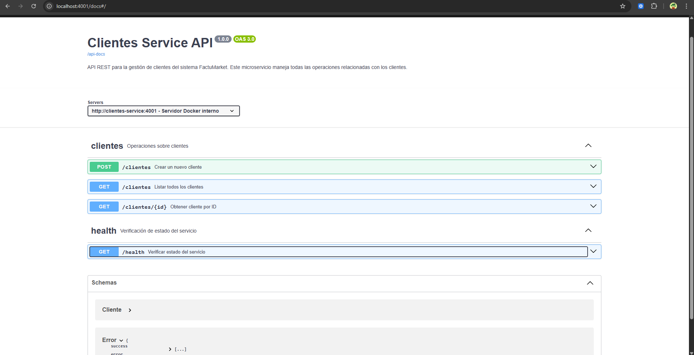
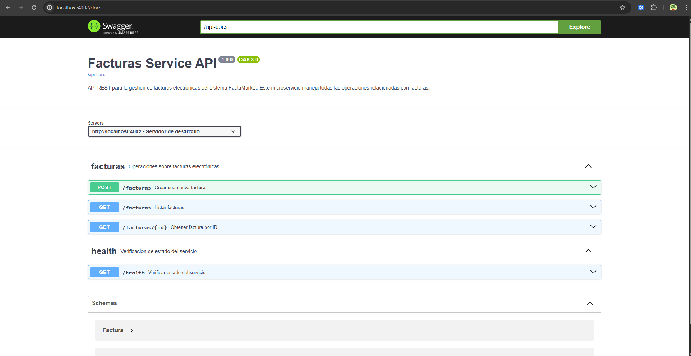
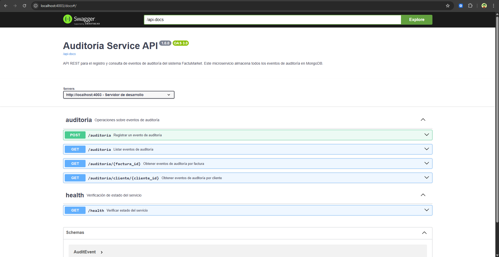

# FactuMarket - Sistema de Facturación Electrónica


> Sistema de microservicios para facturación electrónica construido con Ruby, aplicando **Clean Architecture** y **patrón MVC**, con bases de datos Oracle/SQLite (transaccional) y MongoDB (auditoría).

## 🚀 Inicio Rápido

```bash
# Clonar el repositorio
git clone <repository-url>
cd RubyDoubleV

# Configurar variables de entorno
cp .env.example .env

# Levantar servicios con Docker
docker-compose up --build
```

**Servicios disponibles:**

- 🌐 **Clientes**: https://clientes-ruby-double-v.ondeploy.space
- 📄 **Facturas**: https://factura-ruby-double-v.ondeploy.space
- 📊 **Auditoría**: https://auditoria-ruby-double-v.ondeploy.space

## ✨ Características Principales

- ✅ Arquitectura de microservicios independientes
- ✅ Clean Architecture + patrón MVC
- ✅ API REST con documentación Swagger/OpenAPI 3.0
- ✅ Bases de datos: SQLite/Oracle + MongoDB
- ✅ Testing unitario e integración
- ✅ Despliegue con Docker

---

## ⚠️ Decisión Técnica: Base de Datos

**Requisito:** Oracle | **Implementación:** SQLite3 | **Estado:** Arquitectura lista para migración

### ¿Por qué SQLite3 en lugar de Oracle?

**Pragmatismo y facilidad de evaluación:**
- ✅ Ejecutar con `docker-compose up` sin configurar Oracle
- ✅ Sin licencias ni infraestructura adicional
- ✅ Evaluación inmediata del código y arquitectura

**Equivalencia técnica:**
- Demuestra los mismos principios: Clean Architecture, patrón Repository, ORM (ActiveRecord), transacciones ACID
- El código está **100% preparado** para migrar a Oracle cambiando solo la configuración

### Migración a Oracle (3 pasos)

```ruby
# 1. Gemfile
gem 'activerecord-oracle_enhanced-adapter'

# 2. config/database.yml
production:
  adapter: oracle_enhanced
  database: //oracle-host:1521/XEPDB1
  username: factumarket
  password: <%= ENV['ORACLE_PASSWORD'] %>

# 3. Ejecutar migraciones (sin cambios)
```

**Cero cambios en:** Dominio, Use Cases, Repositorios, Controladores, Tests

### Estrategia de Persistencia

| Servicio | Base de Datos | Propósito |
|----------|---------------|-----------|
| **Clientes/Facturas** | SQLite3 → Oracle | Transaccional (ACID) |
| **Auditoría** | MongoDB | Eventos y logs (NoSQL) |

Esta arquitectura polglota demuestra conocimiento de:
- Bases de datos SQL y NoSQL
- Patrón CQRS
- Event Sourcing
- Principio de inversión de dependencias (SOLID)

---

## 📚 Documentación

| Documento                                             | Descripción                                       |
| ----------------------------------------------------- | ------------------------------------------------- |
| 📖 [**Uso del Sistema**](docs/USO%20DEL%20SISTEMA.md) | Ejemplos de API, endpoints y cómo usar el sistema |
| 🏗️ [**Arquitectura**](docs/ARQUITECTURA.md)           | Patrones, estructura y decisiones de diseño       |
| 🧪 [**Testing**](docs/TESTING.md)                     | Guía completa de pruebas unitarias e integración  |
| 📊 [**Diagramas**](docs/DIAGRAMAS.md)                 | Diagramas de arquitectura y flujos                |

## 🛠️ Requisitos

**Con Docker (Recomendado):**

- Docker >= 20.x
- Docker Compose >= 2.x

**Sin Docker:**

- Ruby >= 3.2
- SQLite3
- MongoDB >= 5.0

## 🐳 Docker Commands

```bash
# Iniciar servicios
docker-compose up

# Iniciar en background
docker-compose up -d

# Ver logs
docker-compose logs -f

# Detener servicios
docker-compose down
```

## 📋 Health Checks

Verificar que los servicios estén corriendo:

```bash
curl https://clientes-ruby-double-v.ondeploy.space/health
curl https://factura-ruby-double-v.ondeploy.space/health
curl https://auditoria-ruby-double-v.ondeploy.space/health
```

## 📖 Documentación Swagger

Cada servicio incluye documentación interactiva Swagger UI:

| Servicio      | Swagger UI                                                   | OpenAPI Spec                                                         |
| ------------- | ------------------------------------------------------------ | -------------------------------------------------------------------- |
| **Clientes**  | [/docs](https://clientes-ruby-double-v.ondeploy.space/docs)  | [/api-docs](https://clientes-ruby-double-v.ondeploy.space/api-docs)  |
| **Facturas**  | [/docs](https://factura-ruby-double-v.ondeploy.space/docs)   | [/api-docs](https://factura-ruby-double-v.ondeploy.space/api-docs)   |
| **Auditoría** | [/docs](https://auditoria-ruby-double-v.ondeploy.space/docs) | [/api-docs](https://auditoria-ruby-double-v.ondeploy.space/api-docs) |

### 📸 Vistas Previas de Swagger UI

**Servicio de Clientes**



**Servicio de Facturas**



**Servicio de Auditoría**



## 🧪 Testing

```bash
# Pruebas unitarias
cd clientes-service && bundle exec rspec spec/domain/

# Pruebas de integración
cd facturas-service && bundle exec rspec spec/integration/

# Ejecutar todos los tests
./scripts/test.sh
```

Ver [documentación completa de testing](docs/TESTING.md) para más detalles.

## 🛠️ Stack Tecnológico

- **Backend**: Ruby 3.2+ con Sinatra
- **Bases de Datos**: SQLite/Oracle + MongoDB
- **Testing**: RSpec + WebMock
- **Documentación**: OpenAPI 3.0 + Swagger UI
- **Deployment**: Docker + Docker Compose

## 👨‍💻 Autor

Desarrollado por **Justin Hernandez Tobinson** como prueba técnica para Double V Partners.

---

**📌 Nota**: Este README proporciona una vista rápida del proyecto. Para información detallada, consulta la [documentación completa](docs/).
