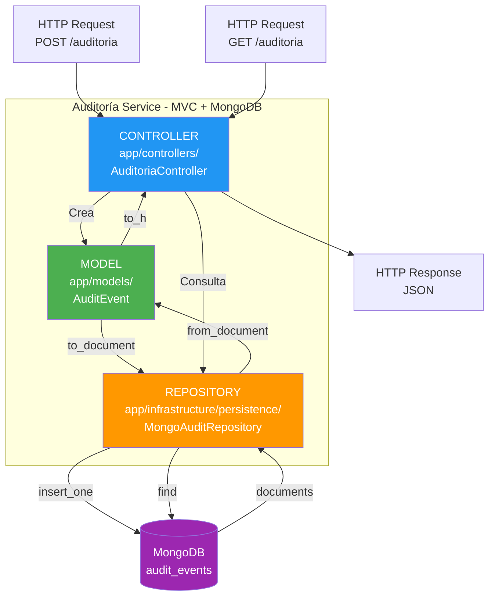
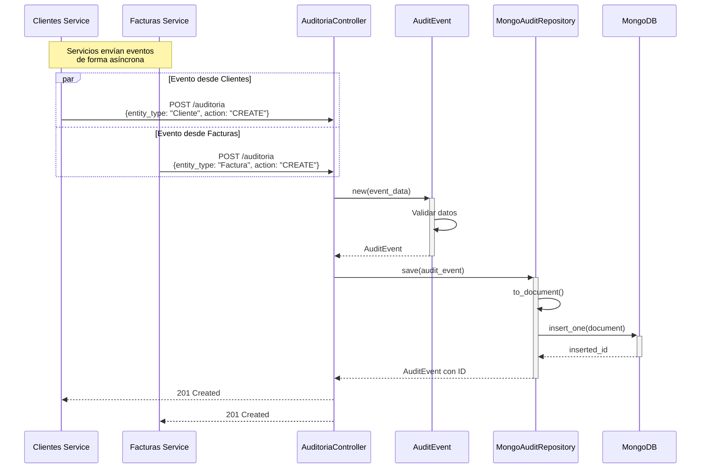
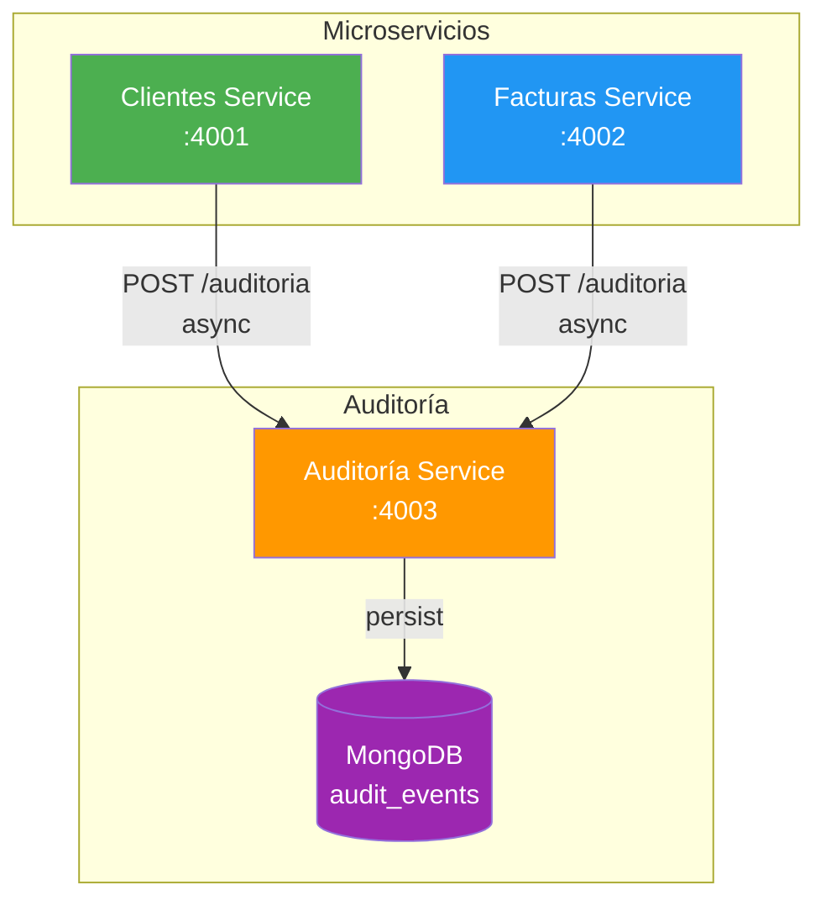
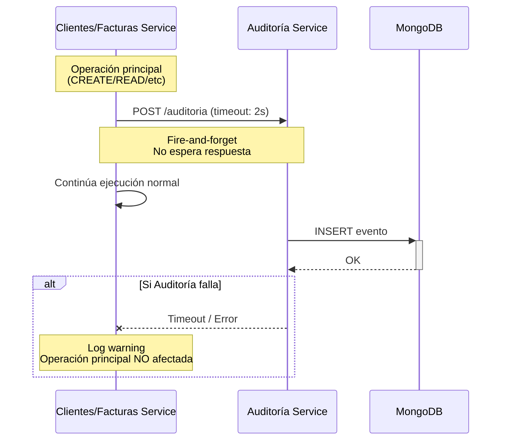

# Servicio de Auditoría - FactuMarket

Microservicio responsable del registro y consulta de eventos de auditoría del sistema FactuMarket.

## Propósito

Este servicio actúa como **registro centralizado de eventos** para todo el sistema, permitiendo:
- Registrar todos los eventos de los microservicios (CREATE, READ, UPDATE, DELETE, LIST)
- Consultar eventos por entidad (Factura, Cliente)
- Filtrar eventos por acción o estado
- Proporcionar trazabilidad completa del sistema
- Detectar errores y patrones de uso

## Características Principales

✅ **Base de datos NoSQL (MongoDB)** para alta velocidad de escritura
✅ **Esquema flexible** para diferentes tipos de eventos
✅ **Consultas eficientes** por entidad, acción y estado
✅ **API REST simple** con patrón MVC
✅ **Sin dependencias** de otros servicios (independiente)
✅ **Registro asíncrono** desde otros servicios

## Arquitectura

Implementa el patrón **MVC** con persistencia en MongoDB.



### Flujo de Registro de Evento



## Componentes Principales

### 1. Model (MVC)

**`app/models/audit_event.rb`**
- Representa un evento de auditoría
- Atributos:
  - `entity_type`: Tipo de entidad (Cliente, Factura, etc.)
  - `entity_id`: ID de la entidad
  - `action`: Acción realizada (CREATE, READ, UPDATE, DELETE, LIST)
  - `details`: Descripción del evento
  - `status`: Estado (SUCCESS, ERROR)
  - `timestamp`: Fecha/hora del evento
  - `created_at`: Fecha de registro
- Métodos de conversión: `to_h`, `to_document`, `from_document`

### 2. Repository (Infrastructure)

**`app/infrastructure/persistence/mongo_audit_repository.rb`**
- Gestiona operaciones con MongoDB
- Operaciones:
  - `save`: Registra un nuevo evento
  - `find_by_entity`: Busca eventos por tipo y ID de entidad
  - `find_by_factura_id`: Eventos de una factura específica
  - `find_by_cliente_id`: Eventos de un cliente específico
  - `find_all`: Todos los eventos (con límite)
  - `find_by_action`: Filtra por acción (CREATE, READ, etc.)
  - `find_by_status`: Filtra por estado (SUCCESS, ERROR)

### 3. Controller (MVC)

**`app/controllers/auditoria_controller.rb`**
- API REST con Sinatra
- Expone endpoints para registro y consulta
- Retorna respuestas JSON

## API REST Endpoints

### POST /auditoria
Registra un nuevo evento de auditoría.

**Request:**
```json
{
  "entity_type": "Factura",
  "entity_id": 1,
  "action": "CREATE",
  "details": "Factura F-20250113-ABC123 creada para cliente 1. Monto: 1500000",
  "status": "SUCCESS",
  "timestamp": "2025-01-13T10:35:00Z"
}
```

**Campos:**
- `entity_type` (string): Cliente, Factura, etc.
- `entity_id` (integer, opcional): ID de la entidad
- `action` (string): CREATE, READ, UPDATE, DELETE, LIST
- `details` (string): Descripción del evento
- `status` (string): SUCCESS o ERROR
- `timestamp` (string): ISO 8601 format

**Response (201 Created):**
```json
{
  "success": true,
  "message": "Evento de auditoría registrado",
  "data": {
    "id": "65a1b2c3d4e5f6789abcdef0",
    "entity_type": "Factura",
    "entity_id": 1,
    "action": "CREATE",
    "details": "Factura F-20250113-ABC123 creada...",
    "status": "SUCCESS",
    "timestamp": "2025-01-13T10:35:00Z",
    "created_at": "2025-01-13T10:35:00.123Z"
  }
}
```

### GET /auditoria/:factura_id
Consulta todos los eventos de una factura específica.

**Request:**
```bash
GET /auditoria/1
```

**Response (200 OK):**
```json
{
  "success": true,
  "data": [
    {
      "id": "65a1b2c3d4e5f6789abcdef0",
      "entity_type": "Factura",
      "entity_id": 1,
      "action": "CREATE",
      "details": "Factura F-20250113-ABC123 creada para cliente 1. Monto: 1500000",
      "status": "SUCCESS",
      "timestamp": "2025-01-13T10:35:00Z",
      "created_at": "2025-01-13T10:35:00.123Z"
    },
    {
      "id": "65a1b2c3d4e5f6789abcdef1",
      "entity_type": "Factura",
      "entity_id": 1,
      "action": "READ",
      "details": "Factura F-20250113-ABC123 consultada",
      "status": "SUCCESS",
      "timestamp": "2025-01-13T10:40:00Z",
      "created_at": "2025-01-13T10:40:00.456Z"
    }
  ],
  "count": 2
}
```

### GET /auditoria/cliente/:cliente_id
Consulta todos los eventos de un cliente específico.

**Request:**
```bash
GET /auditoria/cliente/1
```

**Response:** Similar al endpoint anterior

### GET /auditoria
Lista eventos con filtros opcionales.

**Sin filtros (últimos 100):**
```bash
GET /auditoria
```

**Filtrar por acción:**
```bash
GET /auditoria?action=CREATE&limit=50
```

**Filtrar por estado:**
```bash
GET /auditoria?status=ERROR&limit=20
```

**Parámetros opcionales:**
- `action`: CREATE, READ, UPDATE, DELETE, LIST
- `status`: SUCCESS, ERROR
- `limit`: Número máximo de resultados (default: 100)

**Response (200 OK):**
```json
{
  "success": true,
  "data": [
    {
      "id": "65a1b2c3d4e5f6789abcdef0",
      "entity_type": "Cliente",
      "entity_id": 1,
      "action": "CREATE",
      "details": "Cliente creado: Empresa ABC S.A.",
      "status": "SUCCESS",
      "timestamp": "2025-01-13T10:30:00Z",
      "created_at": "2025-01-13T10:30:00.123Z"
    }
  ],
  "count": 1
}
```

### GET /health
Health check del servicio.

**Response:**
```json
{
  "success": true,
  "service": "auditoria-service",
  "status": "running",
  "timestamp": "2025-01-13T10:30:00Z"
}
```

## Base de Datos MongoDB

### Collection: audit_events

**Esquema (con validación):**
```javascript
{
  entity_type: String,     // Required: Cliente, Factura, etc.
  entity_id: Integer,      // Optional: ID de la entidad
  action: String,          // Required: CREATE, READ, UPDATE, DELETE, LIST
  details: String,         // Optional: Descripción del evento
  status: String,          // Required: SUCCESS, ERROR
  timestamp: String,       // Required: ISO 8601 timestamp
  created_at: Date         // Required: Fecha de creación del registro
}
```

### Índices

Para optimizar las consultas:

```javascript
// Índice compuesto para búsqueda por entidad
db.audit_events.createIndex({ entity_type: 1, entity_id: 1 })

// Índice para ordenar por fecha
db.audit_events.createIndex({ created_at: -1 })

// Índices para filtros
db.audit_events.createIndex({ action: 1 })
db.audit_events.createIndex({ status: 1 })
db.audit_events.createIndex({ timestamp: -1 })
```

### Ventajas de MongoDB para Auditoría

✅ **Alta velocidad de escritura**: Escrituras muy rápidas sin bloqueos
✅ **Esquema flexible**: Puede almacenar diferentes tipos de eventos
✅ **Escalabilidad horizontal**: Fácil de escalar con sharding
✅ **Consultas eficientes**: Índices optimizados para búsquedas comunes
✅ **Sin relaciones complejas**: No requiere JOINs
✅ **Time-series friendly**: Ideal para datos temporales

## Instalación y Ejecución

### Requisitos

- Ruby >= 2.7.0
- MongoDB >= 5.0

### Setup Local

```bash
# Instalar MongoDB
# macOS: brew install mongodb-community
# Ubuntu: sudo apt-get install mongodb
# Windows: Descargar desde mongodb.com

# Iniciar MongoDB
mongod --dbpath /path/to/data

# Instalar dependencias del servicio
bundle install

# Configurar variables de entorno
cp .env.example .env

# Editar .env
# MONGO_URL=localhost:27017
# MONGO_DATABASE=auditoria_db

# Inicializar colección con validación (opcional)
mongosh auditoria_db < ../db/init_mongodb.js

# Iniciar servidor
bundle exec puma config.ru -p 4003
```

### Con Docker

```bash
# Desde la raíz del proyecto
docker-compose up auditoria-service mongodb
```

Docker Compose inicia:
- MongoDB en puerto 27017
- Servicio de Auditoría en puerto 4003

## Testing

### Pruebas manuales

```bash
# 1. Verificar MongoDB está corriendo
mongosh --eval "db.version()"

# 2. Health check
curl http://localhost:4003/health

# 3. Registrar evento de prueba
curl -X POST http://localhost:4003/auditoria \
  -H "Content-Type: application/json" \
  -d '{
    "entity_type": "Cliente",
    "entity_id": 1,
    "action": "CREATE",
    "details": "Cliente de prueba creado",
    "status": "SUCCESS",
    "timestamp": "2025-01-13T10:00:00Z"
  }'

# 4. Consultar todos los eventos
curl http://localhost:4003/auditoria?limit=10

# 5. Filtrar por acción
curl "http://localhost:4003/auditoria?action=CREATE"

# 6. Filtrar por estado ERROR
curl "http://localhost:4003/auditoria?status=ERROR"

# 7. Eventos de cliente específico
curl http://localhost:4003/auditoria/cliente/1
```

### Verificar datos en MongoDB

```bash
# Conectar a MongoDB
mongosh auditoria_db

# Ver todos los eventos
db.audit_events.find().pretty()

# Contar eventos
db.audit_events.countDocuments()

# Eventos por tipo de entidad
db.audit_events.aggregate([
  { $group: { _id: "$entity_type", count: { $sum: 1 } } }
])

# Eventos de errores
db.audit_events.find({ status: "ERROR" }).pretty()

# Eventos de las últimas 24 horas
db.audit_events.find({
  created_at: { $gte: new Date(Date.now() - 24*60*60*1000) }
}).pretty()
```

## Estructura de Archivos

```
auditoria-service/
├── app/
│   ├── controllers/
│   │   └── auditoria_controller.rb       # API REST (MVC)
│   ├── models/
│   │   └── audit_event.rb                # Modelo de evento (MVC)
│   └── infrastructure/
│       └── persistence/
│           └── mongo_audit_repository.rb # Repo MongoDB
├── config/
│   └── environment.rb                    # Configuración
├── .env.example                          # Variables de entorno
├── config.ru                             # Rack config
├── Dockerfile                            # Docker image
├── Gemfile                               # Dependencias Ruby
└── README.md                             # Este archivo
```

## Variables de Entorno

```bash
PORT=4003                          # Puerto del servicio
MONGO_URL=localhost:27017          # URL de MongoDB
MONGO_DATABASE=auditoria_db        # Nombre de base de datos
RACK_ENV=development               # Ambiente
```

## Integración con Otros Servicios



### Patrón de Comunicación



### Servicio de Clientes
Envía eventos cuando:
- Se crea un cliente → `{ entity_type: "Cliente", action: "CREATE" }`
- Se consulta un cliente → `{ entity_type: "Cliente", action: "READ" }`
- Se lista clientes → `{ entity_type: "Cliente", action: "LIST" }`
- Ocurre un error → `{ status: "ERROR" }`

### Servicio de Facturas
Envía eventos cuando:
- Se crea una factura → `{ entity_type: "Factura", action: "CREATE" }`
- Se consulta una factura → `{ entity_type: "Factura", action: "READ" }`
- Se listan facturas → `{ entity_type: "Factura", action: "LIST" }`
- Falla validación de cliente → `{ status: "ERROR" }`

### Características de Integración

**Fire-and-Forget (Asíncrono):**
- Los servicios no esperan respuesta
- Si el servicio de auditoría está caído, no afecta la operación principal
- Timeout configurado: 2 segundos

**Ejemplo de código de integración:**
```ruby
# En servicios de Clientes/Facturas
def register_audit_event(entity_type:, entity_id:, action:, details:, status:)
  HTTParty.post(
    "#{@auditoria_service_url}/auditoria",
    body: {
      entity_type: entity_type,
      entity_id: entity_id,
      action: action,
      details: details,
      status: status,
      timestamp: Time.now.utc.iso8601
    }.to_json,
    headers: { 'Content-Type' => 'application/json' },
    timeout: 2
  )
rescue StandardError => e
  puts "Warning: Failed to register audit event: #{e.message}"
end
```

## Casos de Uso

### 1. Auditoría de Cumplimiento
Consultar todas las operaciones realizadas en un período:

```bash
# Todos los eventos del día
curl "http://localhost:4003/auditoria?limit=1000"
```

### 2. Detección de Errores
Identificar problemas en el sistema:

```bash
# Todos los errores
curl "http://localhost:4003/auditoria?status=ERROR&limit=100"
```

### 3. Trazabilidad de Factura
Seguir el ciclo de vida completo de una factura:

```bash
# Eventos de factura ID 1
curl http://localhost:4003/auditoria/1
```

### 4. Actividad de Cliente
Ver todas las operaciones relacionadas con un cliente:

```bash
# Eventos de cliente ID 1
curl http://localhost:4003/auditoria/cliente/1
```

### 5. Métricas de Uso
Análisis con MongoDB:

```javascript
// Operaciones más comunes
db.audit_events.aggregate([
  { $group: { _id: "$action", count: { $sum: 1 } } },
  { $sort: { count: -1 } }
])

// Tasa de errores por hora
db.audit_events.aggregate([
  {
    $group: {
      _id: {
        hour: { $hour: "$created_at" },
        status: "$status"
      },
      count: { $sum: 1 }
    }
  }
])
```

## Mejoras Futuras

- [ ] Implementar retención de datos (eliminar eventos antiguos)
- [ ] Agregar índices TTL para limpieza automática
- [ ] Implementar agregaciones pre-calculadas
- [ ] Agregar exportación de eventos (CSV, JSON)
- [ ] Dashboard de visualización de eventos
- [ ] Alertas en tiempo real para eventos ERROR
- [ ] Integración con Elasticsearch para búsqueda avanzada
- [ ] Implementar streaming de eventos (WebSockets)
- [ ] Agregar autenticación para endpoints de consulta
- [ ] Soporte para búsqueda de texto completo

## Alta Disponibilidad (Producción)

Para producción, configurar MongoDB con:

### Replica Set
```yaml
# docker-compose.yml
mongodb:
  image: mongo:7.0
  command: --replSet rs0
  environment:
    MONGO_INITDB_ROOT_USERNAME: admin
    MONGO_INITDB_ROOT_PASSWORD: password
```

### Sharding
Para grandes volúmenes de eventos, considerar sharding por:
- `entity_type`
- Rango de fechas

## Monitoreo

### Métricas importantes:
- Tasa de eventos por segundo
- Latencia de escritura
- Tamaño de la colección
- Uso de índices
- Errores registrados

### Comandos útiles:
```javascript
// Estadísticas de colección
db.audit_events.stats()

// Uso de índices
db.audit_events.aggregate([{ $indexStats: {} }])

// Tamaño de base de datos
db.stats()
```

## Contacto

Desarrollado para FactuMarket S.A.

Ver [README principal](../README.md) para documentación completa del sistema.
