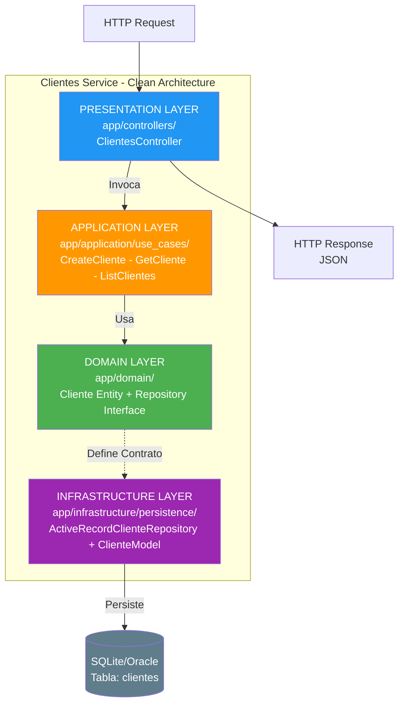
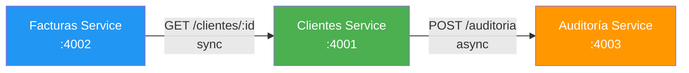
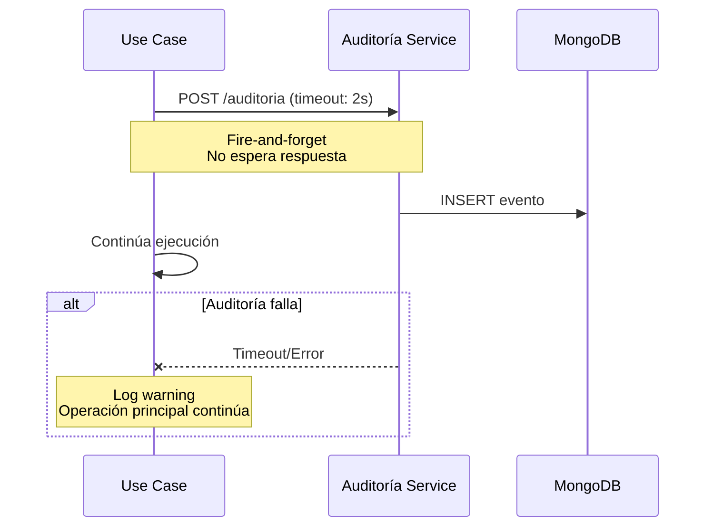
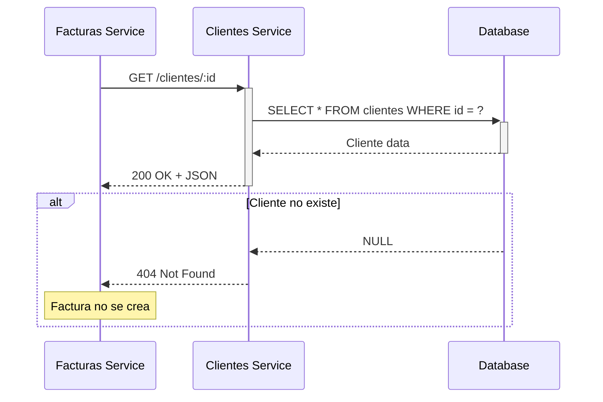

# Servicio de Clientes - FactuMarket

Microservicio responsable de la gestión completa de clientes del sistema de facturación electrónica FactuMarket.

## Propósito

Este servicio gestiona toda la información relacionada con los clientes de la empresa, permitiendo:
- Registrar nuevos clientes (personas naturales o jurídicas)
- Consultar información de clientes existentes
- Listar todos los clientes registrados
- Registrar automáticamente eventos de auditoría por cada operación

## Arquitectura

Este servicio implementa **Clean Architecture** combinado con el patrón **MVC**, proporcionando una separación clara de responsabilidades y facilitando el mantenimiento y testing.

### Capas de Clean Architecture



### Componentes Principales

#### 1. Domain Layer (Lógica de Negocio Pura)

**`app/domain/entities/cliente.rb`**
- Entidad de dominio que representa un Cliente
- Contiene las reglas de negocio y validaciones:
  - Nombre requerido
  - Identificación única requerida
  - Correo con formato válido
  - Dirección requerida
- No tiene dependencias de frameworks

**`app/domain/repositories/cliente_repository.rb`**
- Interface/contrato para el repositorio
- Define operaciones: save, find_by_id, find_all, etc.
- Permite cambiar la implementación sin afectar el dominio

#### 2. Application Layer (Casos de Uso)

**`app/application/use_cases/create_cliente.rb`**
- Orquesta la creación de un cliente
- Valida que no exista duplicado por identificación
- Persiste usando el repositorio
- Registra evento en servicio de auditoría

**`app/application/use_cases/get_cliente.rb`**
- Recupera un cliente por ID
- Registra evento de consulta en auditoría

**`app/application/use_cases/list_clientes.rb`**
- Lista todos los clientes del sistema
- Registra evento de listado en auditoría

#### 3. Infrastructure Layer (Adaptadores)

**`app/infrastructure/persistence/active_record_cliente_repository.rb`**
- Implementación concreta del repositorio usando ActiveRecord
- Convierte entre modelos ActiveRecord y entidades de dominio
- Maneja la persistencia en SQLite/Oracle

**`app/models/cliente_model.rb`**
- Modelo ActiveRecord (MVC)
- Mapeo con tabla `clientes` en base de datos

#### 4. Presentation Layer (MVC)

**`app/controllers/clientes_controller.rb`**
- Controller Sinatra que expone API REST
- Maneja requests HTTP y validaciones de entrada
- Invoca casos de uso correspondientes
- Retorna respuestas JSON

## API REST Endpoints

### POST /clientes
Crea un nuevo cliente en el sistema.

**Request:**
```json
{
  "nombre": "Empresa ABC S.A.",
  "identificacion": "900123456",
  "correo": "contacto@empresaabc.com",
  "direccion": "Calle 123 #45-67, Bogotá"
}
```

**Response (201 Created):**
```json
{
  "success": true,
  "message": "Cliente creado exitosamente",
  "data": {
    "id": 1,
    "nombre": "Empresa ABC S.A.",
    "identificacion": "900123456",
    "correo": "contacto@empresaabc.com",
    "direccion": "Calle 123 #45-67, Bogotá",
    "created_at": "2025-01-13T10:30:00Z",
    "updated_at": "2025-01-13T10:30:00Z"
  }
}
```

**Errores:**
- `400 Bad Request`: Datos inválidos (correo mal formado, campos vacíos)
- `500 Internal Server Error`: Cliente con identificación duplicada

### GET /clientes/:id
Consulta un cliente específico por su ID.

**Request:**
```bash
GET /clientes/1
```

**Response (200 OK):**
```json
{
  "success": true,
  "data": {
    "id": 1,
    "nombre": "Empresa ABC S.A.",
    "identificacion": "900123456",
    "correo": "contacto@empresaabc.com",
    "direccion": "Calle 123 #45-67, Bogotá",
    "created_at": "2025-01-13T10:30:00Z",
    "updated_at": "2025-01-13T10:30:00Z"
  }
}
```

**Errores:**
- `404 Not Found`: Cliente no existe

### GET /clientes
Lista todos los clientes registrados.

**Response (200 OK):**
```json
{
  "success": true,
  "data": [
    {
      "id": 1,
      "nombre": "Empresa ABC S.A.",
      "identificacion": "900123456",
      "correo": "contacto@empresaabc.com",
      "direccion": "Calle 123 #45-67, Bogotá",
      "created_at": "2025-01-13T10:30:00Z",
      "updated_at": "2025-01-13T10:30:00Z"
    }
  ],
  "count": 1
}
```

### GET /health
Health check del servicio.

**Response (200 OK):**
```json
{
  "success": true,
  "service": "clientes-service",
  "status": "running",
  "timestamp": "2025-01-13T10:30:00Z"
}
```

## Base de Datos

### Tabla: clientes

| Campo          | Tipo         | Descripción                          |
|----------------|--------------|--------------------------------------|
| id             | INTEGER      | Primary Key (auto-increment)         |
| nombre         | VARCHAR(255) | Nombre o razón social                |
| identificacion | VARCHAR(50)  | NIT/Cédula (UNIQUE)                  |
| correo         | VARCHAR(255) | Email de contacto                    |
| direccion      | TEXT         | Dirección completa                   |
| created_at     | TIMESTAMP    | Fecha de creación                    |
| updated_at     | TIMESTAMP    | Fecha de última actualización        |

### Migraciones

```ruby
# db/migrate/001_create_clientes.rb
create_table :clientes do |t|
  t.string :nombre, null: false
  t.string :identificacion, null: false, index: { unique: true }
  t.string :correo, null: false
  t.text :direccion, null: false
  t.timestamps
end
```

## Integración con Otros Servicios



### Servicio de Auditoría
El servicio de Clientes registra automáticamente eventos en el servicio de Auditoría para cada operación:

**Eventos registrados:**
- `CREATE`: Cuando se crea un nuevo cliente
- `READ`: Cuando se consulta un cliente
- `LIST`: Cuando se lista clientes

**Comunicación:**
- Protocolo: HTTP POST
- URL: `http://localhost:4003/auditoria`
- Tipo: Asíncrona (fire-and-forget)
- Si falla el registro de auditoría, no afecta la operación principal

**Flujo de Registro de Evento:**


### Servicio de Facturas
El servicio de Facturas consume este servicio para:
- Validar que un cliente existe antes de crear una factura
- Obtener información del cliente

**Flujo de Validación:**


## Instalación y Ejecución

### Requisitos
- Ruby >= 2.7.0
- Bundler
- SQLite3 (desarrollo) u Oracle (producción)

### Setup

```bash
# Instalar dependencias
bundle install

# Configurar variables de entorno
cp .env.example .env

# Ejecutar migraciones
bundle exec rake db:migrate

# Iniciar servidor
bundle exec puma config.ru -p 4001
```

### Con Docker

```bash
# Desde la raíz del proyecto
docker-compose up clientes-service
```

## Testing

### Ejecutar pruebas unitarias

```bash
bundle exec rspec
```

### Pruebas de dominio

Las pruebas se enfocan en la **capa de dominio** (lógica de negocio):

**`spec/domain/entities/cliente_spec.rb`**
- Valida creación correcta de clientes
- Valida que nombre es requerido
- Valida que identificación es requerida
- Valida formato de correo
- Valida que dirección es requerida
- Valida conversión a hash

```bash
bundle exec rspec spec/domain/entities/cliente_spec.rb
```

### Pruebas manuales con curl

```bash
# Crear cliente
curl -X POST http://localhost:4001/clientes \
  -H "Content-Type: application/json" \
  -d '{
    "nombre": "Test S.A.",
    "identificacion": "900111222",
    "correo": "test@example.com",
    "direccion": "Calle Test 123"
  }'

# Listar clientes
curl http://localhost:4001/clientes

# Consultar cliente específico
curl http://localhost:4001/clientes/1
```

## Estructura de Archivos

```
clientes-service/
├── app/
│   ├── controllers/
│   │   └── clientes_controller.rb      # MVC Controller - API REST
│   ├── models/
│   │   └── cliente_model.rb            # ActiveRecord Model
│   ├── domain/
│   │   ├── entities/
│   │   │   └── cliente.rb              # Entidad de dominio
│   │   └── repositories/
│   │       └── cliente_repository.rb   # Interface de repositorio
│   ├── application/
│   │   └── use_cases/
│   │       ├── create_cliente.rb       # Caso de uso: Crear
│   │       ├── get_cliente.rb          # Caso de uso: Consultar
│   │       └── list_clientes.rb        # Caso de uso: Listar
│   └── infrastructure/
│       └── persistence/
│           └── active_record_cliente_repository.rb  # Implementación
├── config/
│   ├── database.yml                    # Config de base de datos
│   └── environment.rb                  # Config de entorno
├── db/
│   └── migrate/
│       └── 001_create_clientes.rb      # Migración de tabla
├── spec/
│   ├── spec_helper.rb
│   └── domain/
│       └── entities/
│           └── cliente_spec.rb         # Tests unitarios
├── .env.example                        # Variables de entorno
├── config.ru                           # Rack config
├── Dockerfile                          # Docker image
├── Gemfile                             # Dependencias Ruby
└── README.md                           # Este archivo
```

## Variables de Entorno

```bash
PORT=4001                              # Puerto del servicio
DATABASE_URL=sqlite3:db/clientes.sqlite3   # URL de base de datos
AUDITORIA_SERVICE_URL=http://localhost:4003  # URL servicio auditoría
RACK_ENV=development                   # Ambiente (development/production)
```

## Configuración para Oracle (Producción)

Para usar Oracle en lugar de SQLite, actualizar `config/database.yml`:

```yaml
production:
  adapter: oracle_enhanced
  database: //localhost:1521/XEPDB1
  username: <%= ENV['ORACLE_USER'] %>
  password: <%= ENV['ORACLE_PASSWORD'] %>
```

Y agregar gem:
```ruby
gem 'ruby-oci8'
gem 'activerecord-oracle_enhanced-adapter'
```

## Principios Aplicados

### Clean Architecture
- **Independencia de Frameworks**: La lógica de negocio no depende de Sinatra ni ActiveRecord
- **Testeable**: Se pueden probar las entidades sin base de datos
- **Independiente de UI**: Podría exponerse como GraphQL o gRPC sin cambiar el dominio
- **Independiente de BD**: Se puede cambiar de SQLite a Oracle sin tocar el dominio

### SOLID
- **Single Responsibility**: Cada clase tiene una única responsabilidad
- **Open/Closed**: Abierto para extensión, cerrado para modificación
- **Liskov Substitution**: Las implementaciones de repositorio son intercambiables
- **Interface Segregation**: Interfaces pequeñas y específicas
- **Dependency Inversion**: El dominio no depende de infraestructura

### DRY (Don't Repeat Yourself)
- Lógica de auditoría centralizada en casos de uso
- Validaciones en la entidad de dominio
- Conversión de datos en el repositorio

## Mejoras Futuras

- [ ] Agregar actualización de clientes (PUT /clientes/:id)
- [ ] Agregar eliminación lógica de clientes
- [ ] Implementar paginación en listado
- [ ] Agregar búsqueda por nombre o identificación
- [ ] Implementar caché con Redis
- [ ] Agregar validación de NIT/RUT con dígito de verificación
- [ ] Implementar autenticación JWT
- [ ] Agregar rate limiting

## Contacto y Soporte

Desarrollado para FactuMarket S.A.
Parte del sistema de facturación electrónica.

Ver documentación completa en el [README principal](../README.md).
