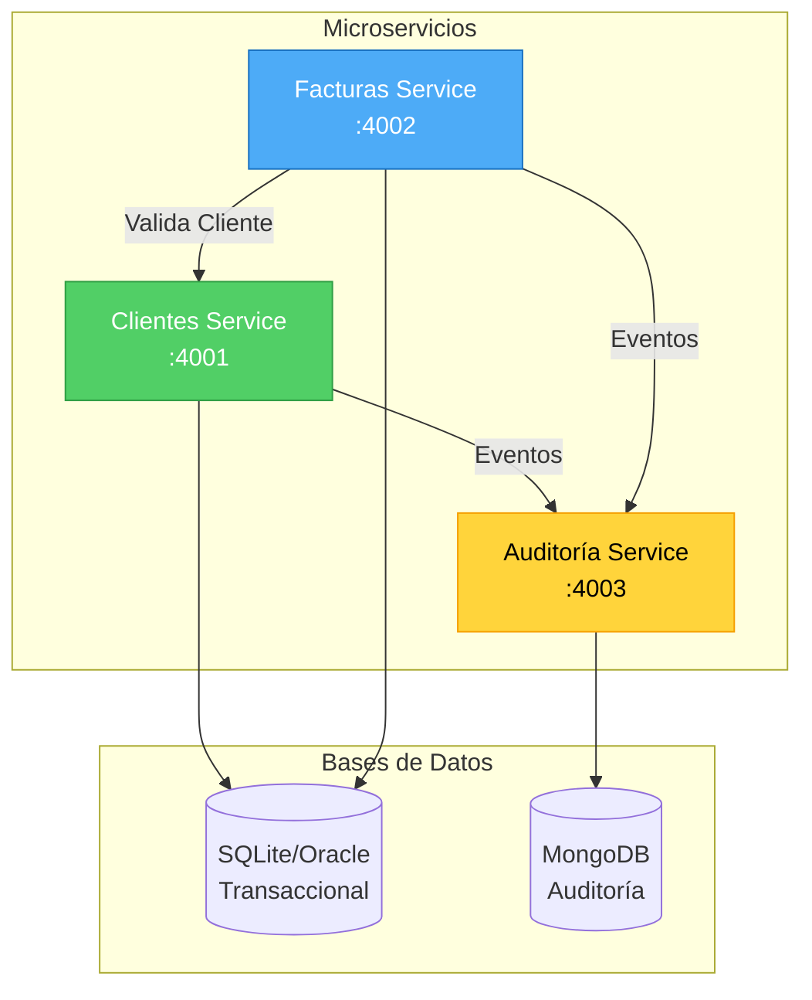
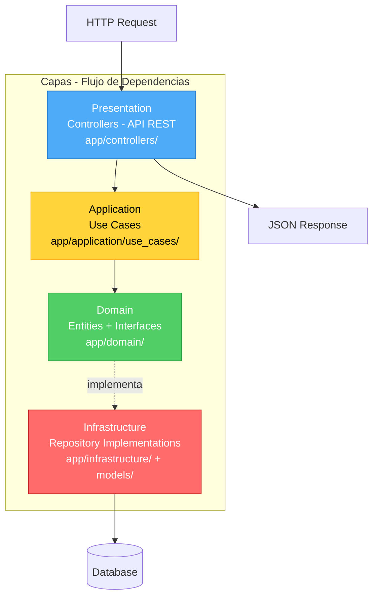
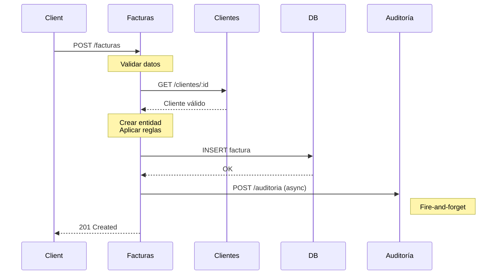
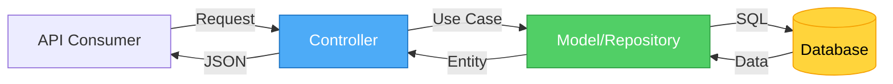

# Arquitectura del Sistema FactuMarket

Sistema de microservicios para facturación electrónica con Clean Architecture y MVC.

---

## Arquitectura General



**Principios:**
- **Microservicios independientes** - Cada uno con su base de datos
- **Comunicación REST** - HTTP para validaciones (síncrono) y eventos (asíncrono)
- **Consistencia eventual** - Auditoría no bloquea operaciones principales

---

## Clean Architecture (Clientes & Facturas)



**Regla de Dependencias:** Solo hacia adentro (Domain no depende de nada)

**Ventajas:**
- Lógica de negocio independiente de frameworks
- Fácil de testear (domain sin dependencias externas)
- Flexible para cambiar tecnologías

---

## Flujo: Crear Factura



**Pasos:**
1. Validar datos de entrada
2. Verificar cliente existe (síncrono)
3. Crear factura en DB
4. Registrar evento en auditoría (asíncrono)
5. Responder al cliente

---

## Patrón MVC



**Componentes:**
- **Controller** (`app/controllers/`) - Maneja HTTP requests
- **Model** (`app/models/`) - ActiveRecord, acceso a datos
- **View** - Respuestas JSON (API REST)

---

## Estrategia de Persistencia

### Datos Transaccionales → SQLite/Oracle

**Clientes & Facturas**
- ACID transactions
- Relaciones entre entidades
- Integridad referencial

### Datos de Auditoría → MongoDB

**Eventos del Sistema**
- Alta velocidad de escritura
- Esquema flexible
- Consultas por rangos de fecha eficientes
- Sin relaciones complejas

---

## Comunicación entre Servicios

### Síncrona (Crítica)
```
Facturas → GET /clientes/:id → Clientes
```
**Uso:** Validación de cliente antes de crear factura
**Timeout:** 5 segundos
**Error:** 422 si cliente no existe

### Asíncrona (No Crítica)
```
Clientes/Facturas → POST /auditoria → Auditoría
```
**Uso:** Registro de eventos
**Patrón:** Fire-and-forget
**Error:** No bloquea operación principal

---

## Stack Tecnológico

| Componente | Tecnología |
|------------|------------|
| Lenguaje | Ruby 3.2+ |
| Framework Web | Sinatra |
| Servidor | Puma |
| ORM | ActiveRecord |
| DB Relacional | SQLite (dev) / Oracle (prod) |
| DB NoSQL | MongoDB |
| HTTP Client | HTTParty |
| Testing | RSpec + WebMock |
| Containerización | Docker + Docker Compose |
| API Docs | OpenAPI 3.0 + Swagger UI |

---

## Mejoras Futuras

### 1. Message Queue para Auditoría
```
Servicios → RabbitMQ/Kafka → Auditoría
```
**Beneficios:** Desacoplamiento total, reintentos automáticos

### 2. API Gateway
```
Kong/Traefik → Router por path → Microservicios
```
**Beneficios:** Autenticación centralizada, rate limiting

### 3. Service Discovery
```
Consul/Eureka → Health checks + Load balancing
```
**Beneficios:** Escalabilidad automática en cloud

### 4. Integración DIAN
```
Facturas → DIAN Adapter (nuevo servicio) → API DIAN
```
**Funcionalidad:** Transformar a XML, firmar, enviar a autoridad tributaria

---

**Última actualización:** Enero 2025
