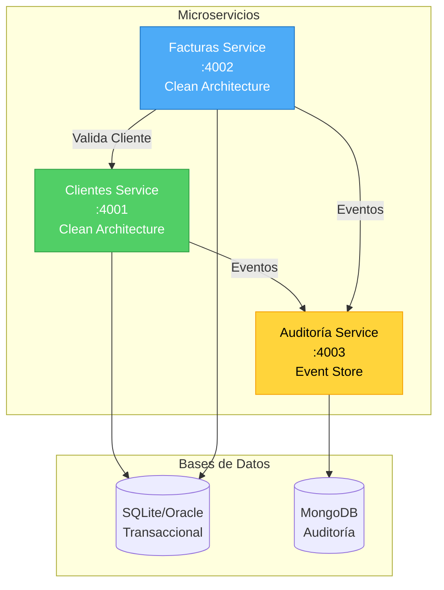
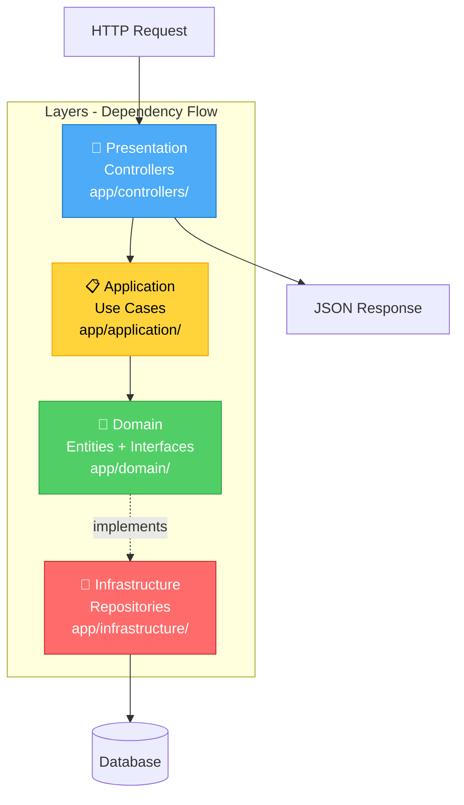
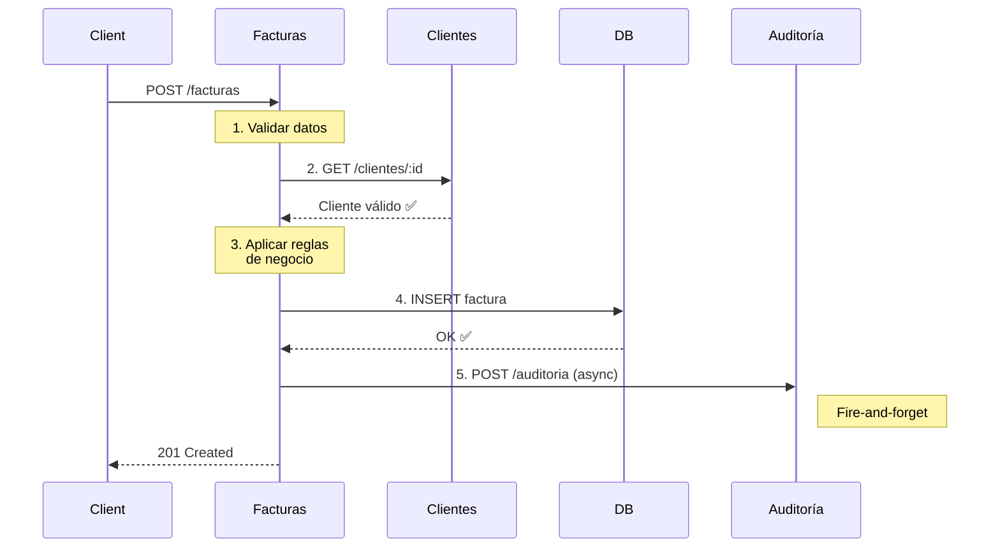

# 🏗️ Arquitectura del Sistema FactuMarket

> Sistema de microservicios para facturación electrónica aplicando **Clean Architecture**, **MVC** y **Domain-Driven Design**.

---

## 📋 Tabla de Contenidos

- [Visión General](#-visión-general)
- [Distribución de Microservicios](#-distribución-de-microservicios)
- [Clean Architecture](#-clean-architecture)
- [Flujos de Comunicación](#-flujos-de-comunicación)
- [Stack Tecnológico](#-stack-tecnológico)

---

## 🌐 Visión General



### Principios de Diseño

| Principio | Descripción |
|-----------|-------------|
| 🔹 **Independencia** | Cada microservicio tiene su propia base de datos |
| 🔹 **Comunicación REST** | HTTP para validaciones (síncrono) y eventos (asíncrono) |
| 🔹 **Consistencia Eventual** | Auditoría no bloquea operaciones críticas |
| 🔹 **Despliegue Independiente** | Cada servicio puede desplegarse por separado |

---

## 📦 Distribución de Microservicios

### 🟢 Clientes Service (Puerto 4001)

```
clientes-service/
├── app/
│   ├── controllers/              # 🎯 Presentation Layer (MVC)
│   │   └── clientes_controller.rb
│   ├── domain/                   # 🧠 Domain Layer (Clean Architecture)
│   │   ├── entities/
│   │   │   └── cliente.rb        # Lógica de negocio pura
│   │   └── repositories/
│   │       └── cliente_repository.rb  # Interfaces
│   ├── application/              # 📋 Application Layer (Use Cases)
│   │   └── use_cases/
│   │       ├── create_cliente.rb
│   │       ├── get_cliente.rb
│   │       └── list_clientes.rb
│   ├── infrastructure/           # 🔌 Infrastructure Layer
│   │   └── persistence/
│   │       └── active_record_cliente_repository.rb
│   └── models/                   # 🗄️ Models (MVC + ActiveRecord)
│       └── cliente_model.rb
├── config/
│   ├── environment.rb
│   └── database.yml
├── public/
│   └── openapi.yaml             # 📖 OpenAPI 3.0 Spec
├── spec/                        # ✅ Tests
│   ├── domain/                  # Tests unitarios
│   └── integration/             # Tests de integración
├── Gemfile
├── config.ru
└── Dockerfile
```

**Responsabilidades:**
- ✅ CRUD de clientes
- ✅ Validaciones de negocio (email, identificación)
- ✅ Registro de eventos en auditoría

---

### 🔵 Facturas Service (Puerto 4002)

```
facturas-service/
├── app/
│   ├── controllers/              # 🎯 Presentation Layer
│   │   └── facturas_controller.rb
│   ├── domain/                   # 🧠 Domain Layer
│   │   ├── entities/
│   │   │   └── factura.rb       # Reglas: monto > 0, fecha válida
│   │   └── repositories/
│   │       └── factura_repository.rb
│   ├── application/              # 📋 Application Layer
│   │   └── use_cases/
│   │       ├── create_factura.rb    # Valida cliente + crea factura
│   │       ├── get_factura.rb
│   │       └── list_facturas.rb
│   ├── infrastructure/           # 🔌 Infrastructure Layer
│   │   └── persistence/
│   │       └── active_record_factura_repository.rb
│   └── models/
│       └── factura_model.rb
├── config/
├── public/
│   └── openapi.yaml
├── spec/
└── Dockerfile
```

**Responsabilidades:**
- ✅ Creación y gestión de facturas
- ✅ Validación de clientes (integración con Clientes Service)
- ✅ Generación de número de factura único
- ✅ Registro de eventos en auditoría

---

### 🟡 Auditoría Service (Puerto 4003)

```
auditoria-service/
├── app/
│   ├── controllers/              # 🎯 API REST
│   │   └── auditoria_controller.rb
│   ├── domain/                   # 🧠 Entidades simples
│   │   └── entities/
│   │       └── audit_event.rb
│   ├── application/              # 📋 Use Cases
│   │   └── use_cases/
│   │       ├── create_audit_event.rb
│   │       ├── get_audit_events_by_factura.rb
│   │       ├── get_audit_events_by_cliente.rb
│   │       └── list_audit_events.rb
│   └── infrastructure/           # 🔌 MongoDB Driver
│       └── persistence/
│           └── mongo_audit_event_repository.rb
├── config/
│   └── environment.rb           # MongoDB connection
├── public/
│   └── openapi.yaml
└── Dockerfile
```

**Responsabilidades:**
- ✅ Registro de todos los eventos del sistema (event store)
- ✅ Consultas de auditoría por entidad (cliente/factura)
- ✅ Filtrado por acción y estado
- ✅ Almacenamiento en MongoDB (alta velocidad de escritura)

---

## 🎯 Clean Architecture

### Capas y Flujo de Dependencias



### Reglas Clave

| Capa | Responsabilidad | Depende de |
|------|----------------|------------|
| **Domain** | Lógica de negocio pura | Nada |
| **Application** | Casos de uso | Domain |
| **Infrastructure** | Implementaciones técnicas | Domain (interfaces) |
| **Presentation** | API REST / HTTP | Application |

**Beneficios:**
- ✅ Lógica de negocio independiente de frameworks
- ✅ Tests unitarios sin dependencias externas
- ✅ Fácil cambiar bases de datos o frameworks

---

## 🔄 Flujos de Comunicación

### Flujo: Crear Factura (Completo)



### Tipos de Comunicación

| Tipo | Ejemplo | Patrón | Timeout | Bloquea |
|------|---------|--------|---------|---------|
| **Síncrona** | Facturas → Clientes | Request-Response | 5s | ✅ Sí |
| **Asíncrona** | Facturas → Auditoría | Fire-and-forget | - | ❌ No |

---

## 💾 Estrategia de Persistencia

### SQLite/Oracle (Transaccional)

**Servicios:** Clientes & Facturas

```
✅ ACID transactions
✅ Relaciones entre entidades
✅ Integridad referencial
✅ Consultas complejas (JOINs)
```

### MongoDB (Auditoría)

**Servicio:** Auditoría

```
✅ Alta velocidad de escritura
✅ Esquema flexible (JSON)
✅ Consultas por fecha eficientes
✅ Sin relaciones complejas
```

---

## 🛠️ Stack Tecnológico

| Componente | Tecnología | Propósito |
|------------|-----------|-----------|
| **Lenguaje** | Ruby 3.2+ | Backend |
| **Framework** | Sinatra | Web minimalista |
| **Servidor** | Puma | HTTP server |
| **ORM** | ActiveRecord | Acceso a BD relacional |
| **DB Relacional** | SQLite/Oracle | Datos transaccionales |
| **DB NoSQL** | MongoDB | Eventos de auditoría |
| **HTTP Client** | HTTParty | Comunicación entre servicios |
| **Testing** | RSpec + WebMock | Pruebas unitarias e integración |
| **Containers** | Docker + Compose | Despliegue |
| **API Docs** | OpenAPI 3.0 + Swagger | Documentación interactiva |

---

## 🔐 Patrones y Principios Aplicados

- ✅ **Clean Architecture** - Separación de responsabilidades
- ✅ **MVC** - Organización de código en Controllers/Models/Views
- ✅ **Repository Pattern** - Abstracción de acceso a datos
- ✅ **Dependency Inversion** - Domain no depende de infraestructura
- ✅ **Circuit Breaker** - Resiliencia en auditoría
- ✅ **Event Store** - Auditoría como registro inmutable de eventos
