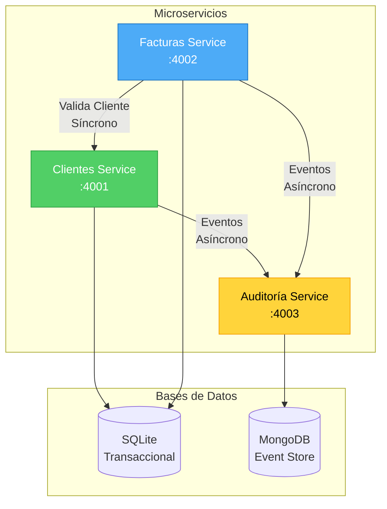
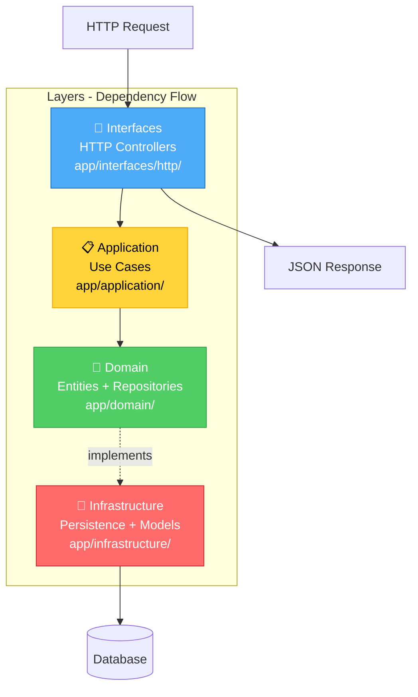
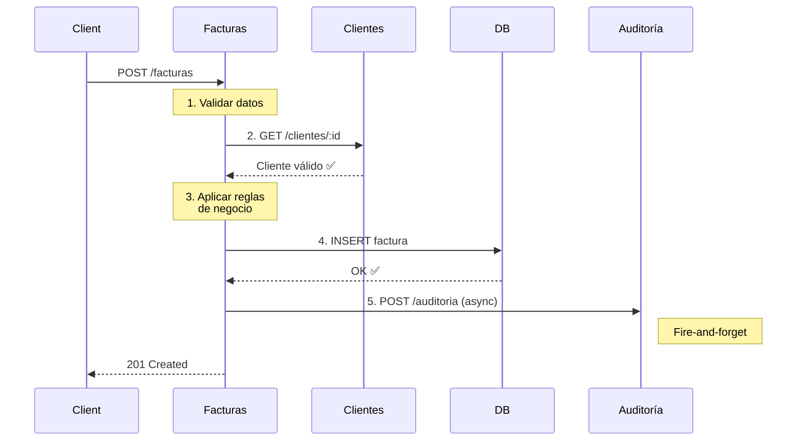

# 🏗️ Arquitectura del Sistema FactuMarket

> Sistema de microservicios para facturación electrónica aplicando **Clean Architecture**, **MVC** y **Domain-Driven Design**.

---

## 📋 Tabla de Contenidos

- [Visión General](#-visión-general)
- [Distribución de Microservicios](#-distribución-de-microservicios)
- [Clean Architecture](#-clean-architecture)
- [Flujos de Comunicación](#-flujos-de-comunicación)
- [Stack Tecnológico](#-stack-tecnológico)

---

## 🌐 Visión General



### Principios de Diseño

| Principio | Descripción |
|-----------|-------------|
| 🔹 **Independencia** | Cada microservicio tiene su propia base de datos |
| 🔹 **Comunicación REST** | HTTP para validaciones (síncrono) y eventos (asíncrono) |
| 🔹 **Consistencia Eventual** | Auditoría no bloquea operaciones críticas |
| 🔹 **Despliegue Independiente** | Cada servicio puede desplegarse por separado |

---

## 📦 Distribución de Microservicios

### 🟢 Clientes Service (Puerto 4001)

```
clientes-service/
├── app/
│   ├── interfaces/               # 🎯 Interfaces Layer
│   │   └── http/
│   │       └── clientes_controller.rb
│   ├── application/              # 📋 Application Layer
│   │   └── use_cases/
│   │       ├── create_cliente.rb
│   │       ├── get_cliente.rb
│   │       └── list_clientes.rb
│   ├── domain/                   # 🧠 Domain Layer
│   │   ├── entities/
│   │   │   └── cliente.rb        # Lógica de negocio pura
│   │   └── repositories/
│   │       └── cliente_repository.rb  # Interfaces
│   └── infrastructure/           # 🔌 Infrastructure Layer
│       └── persistence/
│           ├── active_record_cliente_repository.rb
│           └── cliente_model.rb  # ActiveRecord model
├── config/
│   ├── environment.rb
│   └── database.yml              # SQLite configuration
├── public/
│   └── openapi.yaml             # 📖 OpenAPI 3.0 Spec
├── spec/                        # ✅ Tests
│   ├── domain/                  # Tests unitarios
│   ├── application/             # Tests de casos de uso
│   ├── infrastructure/          # Tests de persistencia
│   └── interfaces/              # Tests de controladores HTTP
├── Gemfile
├── config.ru
└── Dockerfile
```

**Responsabilidades:**
- ✅ CRUD de clientes
- ✅ Validaciones de negocio (email, identificación única)
- ✅ Registro de eventos en auditoría

---

### 🔵 Facturas Service (Puerto 4002)

```
facturas-service/
├── app/
│   ├── interfaces/               # 🎯 Interfaces Layer
│   │   └── http/
│   │       └── facturas_controller.rb
│   ├── application/              # 📋 Application Layer
│   │   └── use_cases/
│   │       ├── create_factura.rb    # Valida cliente + crea factura
│   │       ├── get_factura.rb
│   │       └── list_facturas.rb
│   ├── domain/                   # 🧠 Domain Layer
│   │   ├── entities/
│   │   │   └── factura.rb       # Reglas: monto > 0, fecha válida
│   │   ├── repositories/
│   │   │   └── factura_repository.rb
│   │   └── services/            # Domain Services
│   │       └── cliente_validator.rb
│   └── infrastructure/           # 🔌 Infrastructure Layer
│       └── persistence/
│           ├── active_record_factura_repository.rb
│           └── factura_model.rb # ActiveRecord model
├── config/
│   ├── environment.rb
│   └── database.yml              # SQLite configuration
├── public/
│   └── openapi.yaml
├── spec/
│   ├── domain/
│   ├── application/
│   ├── infrastructure/
│   └── interfaces/
└── Dockerfile
```

**Responsabilidades:**
- ✅ Creación y gestión de facturas
- ✅ Validación de clientes (integración con Clientes Service)
- ✅ Generación de número de factura único (F-YYYYMMDD-HEXCODE)
- ✅ Registro de eventos en auditoría

---

### 🟡 Auditoría Service (Puerto 4003)

```
auditoria-service/
├── app/
│   ├── interfaces/               # 🎯 Interfaces Layer
│   │   └── http/
│   │       └── auditoria_controller.rb
│   ├── application/              # 📋 Application Layer
│   │   └── use_cases/
│   │       ├── create_audit_event.rb
│   │       ├── get_audit_events_by_factura.rb
│   │       ├── get_audit_events_by_cliente.rb
│   │       └── list_audit_events.rb
│   ├── domain/                   # 🧠 Domain Layer
│   │   ├── entities/
│   │   │   └── audit_event.rb
│   │   └── repositories/
│   │       └── audit_event_repository.rb
│   └── infrastructure/           # 🔌 Infrastructure Layer
│       └── persistence/
│           └── mongo_audit_event_repository.rb
├── config/
│   └── environment.rb           # MongoDB connection
├── public/
│   └── openapi.yaml
├── spec/
│   ├── domain/
│   ├── application/
│   ├── infrastructure/
│   └── interfaces/
└── Dockerfile
```

**Responsabilidades:**
- ✅ Registro inmutable de eventos del sistema (Event Store)
- ✅ Consultas de auditoría por cliente/factura
- ✅ Filtrado por acción, estado y rango de fechas
- ✅ Almacenamiento en MongoDB (alta velocidad de escritura)

---

## 🎯 Clean Architecture

### Capas y Flujo de Dependencias



### Reglas Clave

| Capa | Responsabilidad | Depende de | Ubicación |
|------|----------------|------------|-----------|
| **Domain** | Lógica de negocio pura | Nada ❌ | `app/domain/` |
| **Application** | Casos de uso | Domain ✅ | `app/application/` |
| **Infrastructure** | Implementaciones técnicas (DB, APIs) | Domain ✅ | `app/infrastructure/` |
| **Interfaces** | Adaptadores HTTP (Controllers) | Application ✅ | `app/interfaces/http/` |

**Principio de Inversión de Dependencias:**
- Domain define **interfaces** (ej: `FacturaRepository`)
- Infrastructure **implementa** esas interfaces (ej: `ActiveRecordFacturaRepository`)
- Los modelos ActiveRecord (`*_model.rb`) están en Infrastructure, NO en Domain

**Beneficios:**
- ✅ Lógica de negocio independiente de frameworks
- ✅ Tests unitarios sin dependencias externas
- ✅ Fácil cambiar implementaciones de bases de datos sin tocar Domain

---

## 🔄 Flujos de Comunicación

### Flujo: Crear Factura (Completo)



### Tipos de Comunicación

| Tipo | Ejemplo | Patrón | Timeout | Bloquea |
|------|---------|--------|---------|---------|
| **Síncrona** | Facturas → Clientes | Request-Response | 5s | ✅ Sí |
| **Asíncrona** | Facturas → Auditoría | Fire-and-forget | - | ❌ No |

---

## 💾 Estrategia de Persistencia (Polyglot Persistence)

| Base de Datos | Servicios | Propósito | Características |
|---------------|-----------|-----------|-----------------|
| **SQLite** | Clientes, Facturas | Datos transaccionales | ✅ ACID<br/>✅ Relaciones<br/>✅ Integridad referencial |
| **MongoDB** | Auditoría | Event Store | ✅ Alta velocidad de escritura<br/>✅ Esquema flexible (JSON)<br/>✅ Consultas por fecha<br/>✅ Inmutabilidad |

---

## 🛠️ Stack Tecnológico

| Componente | Tecnología | Propósito |
|------------|-----------|-----------|
| **Lenguaje** | Ruby 3.2+ | Backend |
| **Framework** | Sinatra | Web framework minimalista |
| **Servidor** | Puma | HTTP server con concurrencia |
| **ORM** | ActiveRecord | Abstracción de BD relacional |
| **DB Relacional** | SQLite | Transacciones ACID |
| **DB NoSQL** | MongoDB | Event Store para auditoría |
| **HTTP Client** | HTTParty | Comunicación inter-servicios |
| **Testing** | RSpec + WebMock | Unit & Integration tests |
| **Containerización** | Docker + Compose | Orquestación de servicios |
| **API Docs** | OpenAPI 3.0 + Swagger UI | Documentación interactiva |

---

## 🔐 Patrones y Principios Aplicados

| Patrón/Principio | Descripción | Implementación |
|------------------|-------------|----------------|
| **Clean Architecture** | Separación en 4 capas con dependencias unidireccionales | Domain ← Application ← Infrastructure ← Interfaces |
| **Repository Pattern** | Abstracción del acceso a datos | `*Repository` (interface) + `ActiveRecord*Repository` (impl) |
| **Dependency Inversion (SOLID)** | Domain define interfaces, Infrastructure las implementa | Domain no conoce ActiveRecord ni MongoDB |
| **Use Case Pattern** | Lógica de aplicación aislada en casos de uso | `CreateFactura`, `GetCliente`, `ListAuditEvents` |
| **Domain Services** | Lógica que no pertenece a una entidad | `ClienteValidator` (valida cliente en servicio externo) |
| **Event Store** | Registro inmutable de eventos del sistema | Auditoría almacena eventos en MongoDB |
| **Circuit Breaker** | Resiliencia ante fallos de servicios externos | Auditoría no bloquea si falla (fire-and-forget) |
| **API First** | Documentación OpenAPI antes de implementación | Swagger UI en `/docs` para cada servicio |

### SOLID en el Proyecto

- **S**ingle Responsibility: Cada clase tiene una responsabilidad única
- **O**pen/Closed: Extensible sin modificar código existente
- **L**iskov Substitution: Repositorios son intercambiables
- **I**nterface Segregation: Interfaces pequeñas y específicas
- **D**ependency Inversion: Domain define interfaces, Infrastructure implementa
