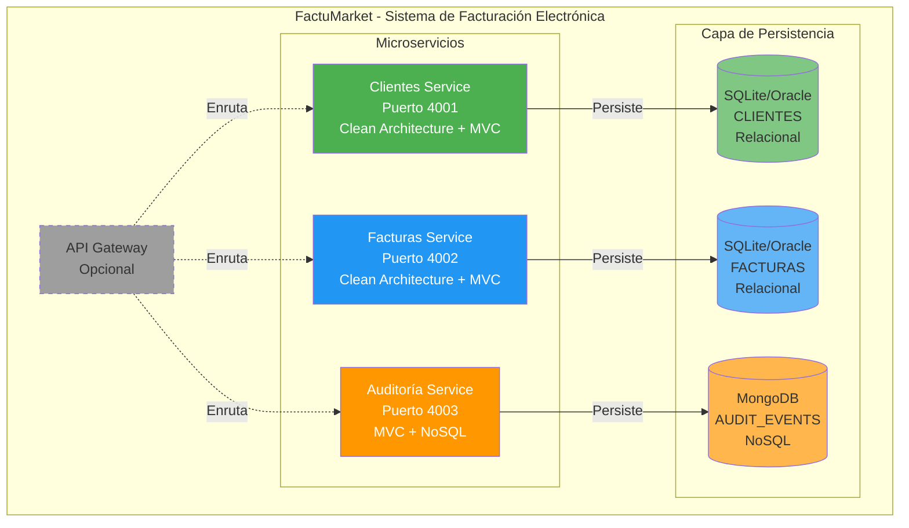
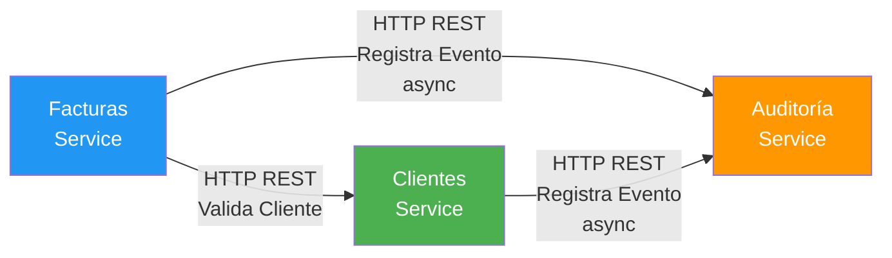
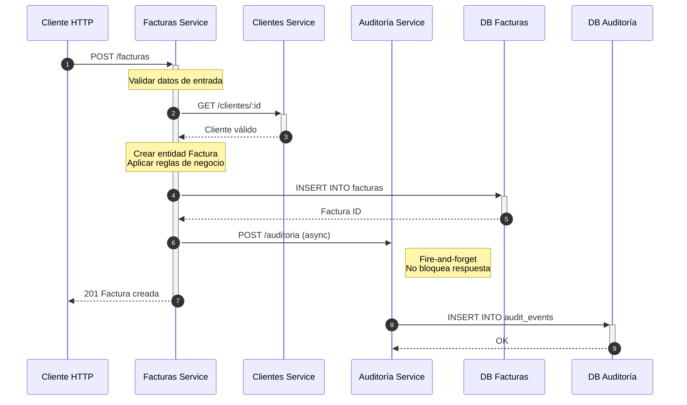
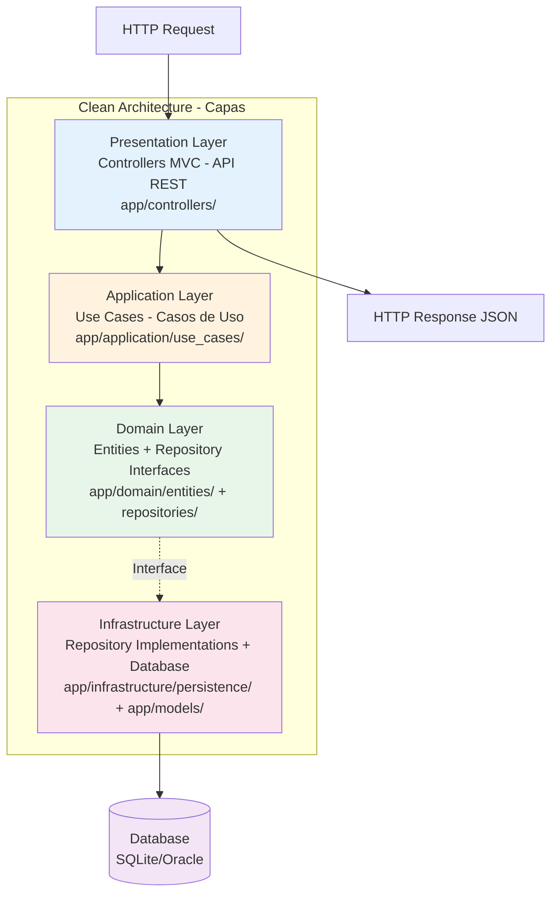
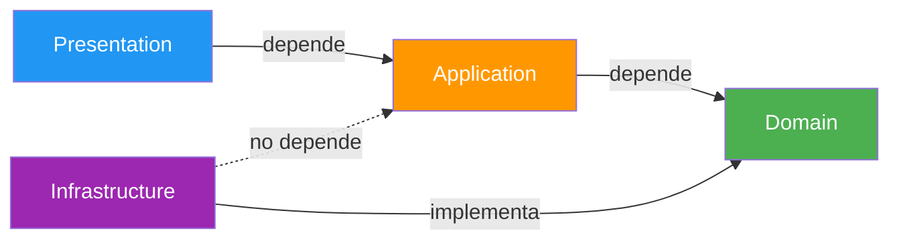
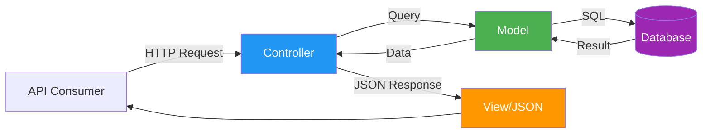
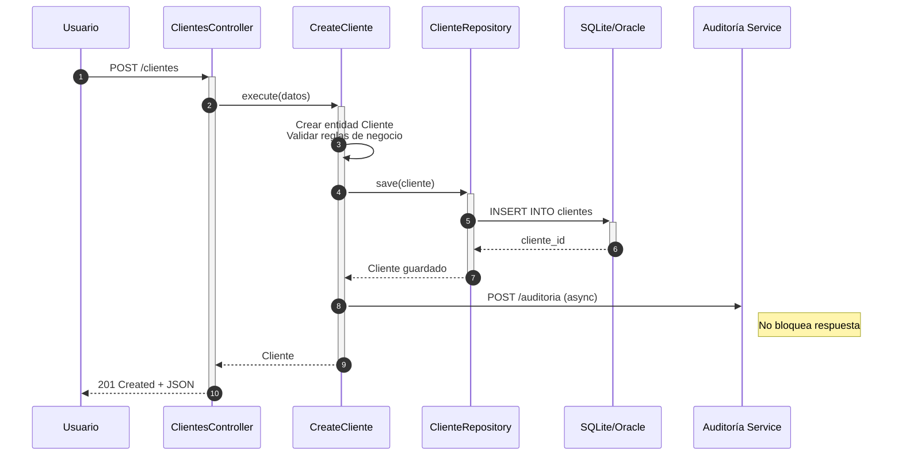
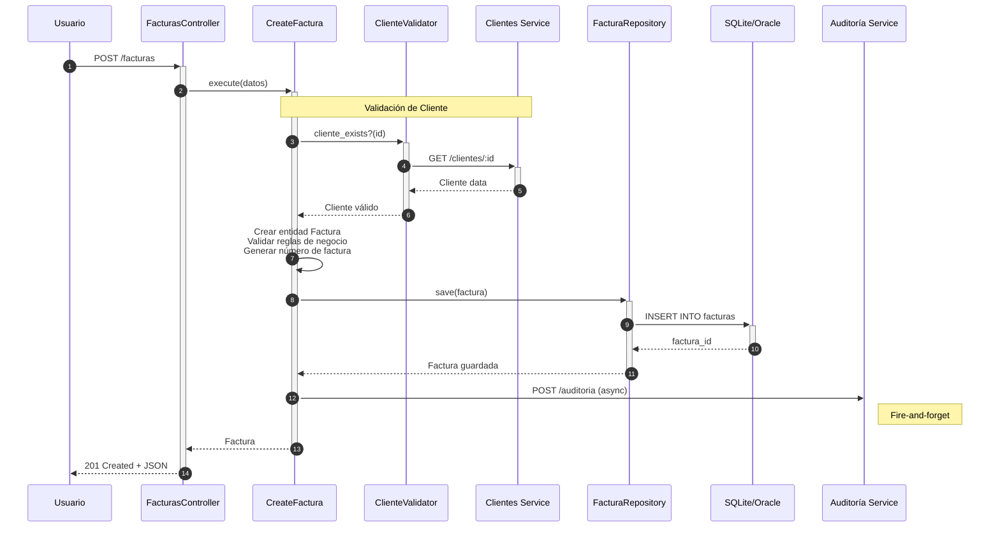

# Arquitectura del Sistema FactuMarket

## Diagrama de Alto Nivel



## Comunicación entre Servicios



### Flujo Detallado de Comunicación



## Principios Arquitectónicos Aplicados

### 1. Microservicios

- **Independencia**: Cada servicio es independiente y puede desplegarse por separado
- **Escalabilidad**: Los servicios pueden escalar de forma independiente según demanda
- **Despliegue Autónomo**: Cada servicio tiene su propio ciclo de vida
- **Base de Datos por Servicio**: Cada microservicio tiene su propia base de datos

### 2. Clean Architecture

Aplicada en **Clientes Service** y **Facturas Service**:



**Dependencias:**


**Ventajas**:
- Lógica de negocio independiente de frameworks
- Fácil de testear (pruebas unitarias de dominio)
- Flexibilidad para cambiar tecnologías de infraestructura
- Separación clara de responsabilidades

### 3. Patrón MVC (Model-View-Controller)



- **Model**: Representación de datos y lógica de negocio (ActiveRecord models)
- **View**: Respuestas JSON (API REST)
- **Controller**: Maneja requests HTTP y orquesta la lógica

### 4. Estrategia de Persistencia

#### Datos Transaccionales (Oracle/SQLite)

- **Clientes**: Información de clientes (CRUD)
- **Facturas**: Facturas electrónicas con relaciones

**Características**:
- ACID transactions
- Relaciones entre entidades
- Consultas complejas con JOINs
- Integridad referencial

#### Datos de Auditoría (MongoDB)

- **Audit Events**: Registro de todas las operaciones

**Características**:
- Alta velocidad de escritura
- Esquema flexible
- Consultas por rangos de fecha eficientes
- No requiere relaciones complejas

## Flujo de Comunicación

### Flujo 1: Crear Cliente



### Flujo 2: Crear Factura



## Consistencia entre Servicios

### Eventual Consistency

El sistema utiliza **consistencia eventual** para los eventos de auditoría:

- Las operaciones principales (CRUD) se ejecutan de forma síncrona
- Los eventos de auditoría se registran de forma asíncrona (fire-and-forget)
- Si falla el registro de auditoría, no afecta la operación principal

### Validación Síncrona

La validación de cliente en el servicio de Facturas es **síncrona**:

- Se hace una llamada HTTP al servicio de Clientes
- Si el cliente no existe, la factura no se crea
- Garantiza integridad referencial entre servicios

## Tecnologías Utilizadas

- **Ruby**: Lenguaje de programación
- **Sinatra**: Framework web ligero
- **Puma**: Servidor de aplicaciones
- **ActiveRecord**: ORM para bases de datos relacionales
- **SQLite**: Base de datos en desarrollo (reemplazable por Oracle en producción)
- **MongoDB**: Base de datos NoSQL para auditoría
- **HTTParty**: Cliente HTTP para comunicación entre servicios
- **RSpec**: Framework de testing
- **Docker**: Containerización

## Escalabilidad y Mejoras Futuras

### Message Queue (Recomendado para Producción)

```
┌──────────┐     ┌──────────┐     ┌──────────┐
│ Clientes │────>│ RabbitMQ │────>│Auditoría │
│ Service  │     │   / Kafka│     │ Service  │
└──────────┘     └──────────┘     └──────────┘
```

**Ventajas**:
- Desacoplamiento total
- Tolerancia a fallos
- Reintento automático
- Escalabilidad horizontal

### API Gateway

```
┌──────────────┐
│ API Gateway  │
│   (Kong/     │
│   Traefik)   │
└──────────────┘
       │
       ├─> /clientes/*  → Clientes Service
       ├─> /facturas/*  → Facturas Service
       └─> /auditoria/* → Auditoría Service
```

**Ventajas**:
- Punto único de entrada
- Autenticación centralizada
- Rate limiting
- Logging y monitoreo

### Service Discovery

Para ambientes cloud:
- **Consul** o **Eureka** para descubrimiento de servicios
- Health checks automáticos
- Load balancing dinámico

## Integración con DIAN (Futura)

El sistema está preparado para integración con la DIAN:

```
┌──────────┐     ┌──────────────┐     ┌──────────┐
│ Facturas │────>│ DIAN Adapter │────>│   DIAN   │
│ Service  │     │   Service    │     │   API    │
└──────────┘     └──────────────┘     └──────────┘
```

Se puede agregar un nuevo microservicio que:
- Reciba facturas del servicio de Facturas
- Transforme al formato XML requerido por DIAN
- Envíe a la API de la DIAN
- Registre el resultado en Auditoría
