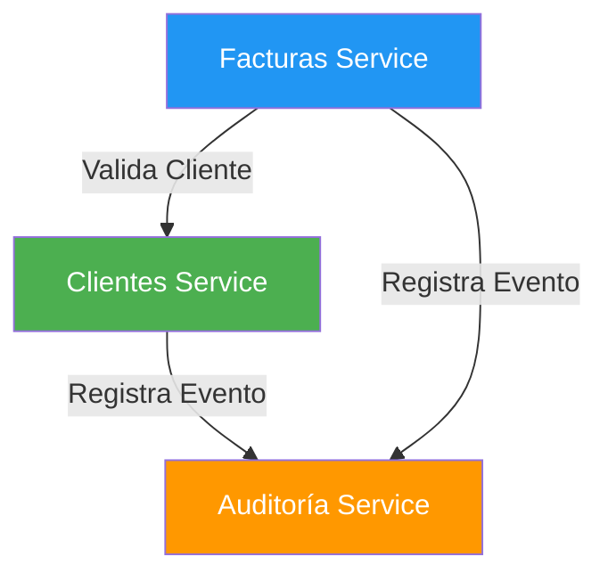
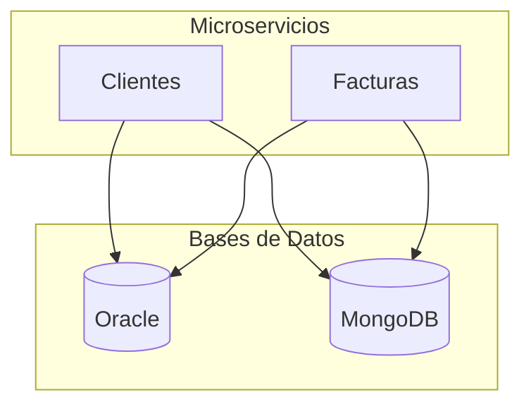
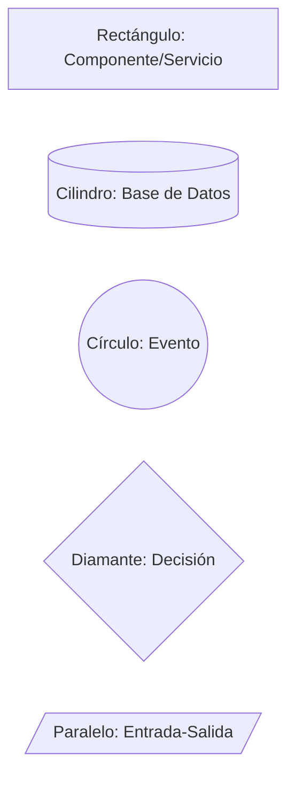
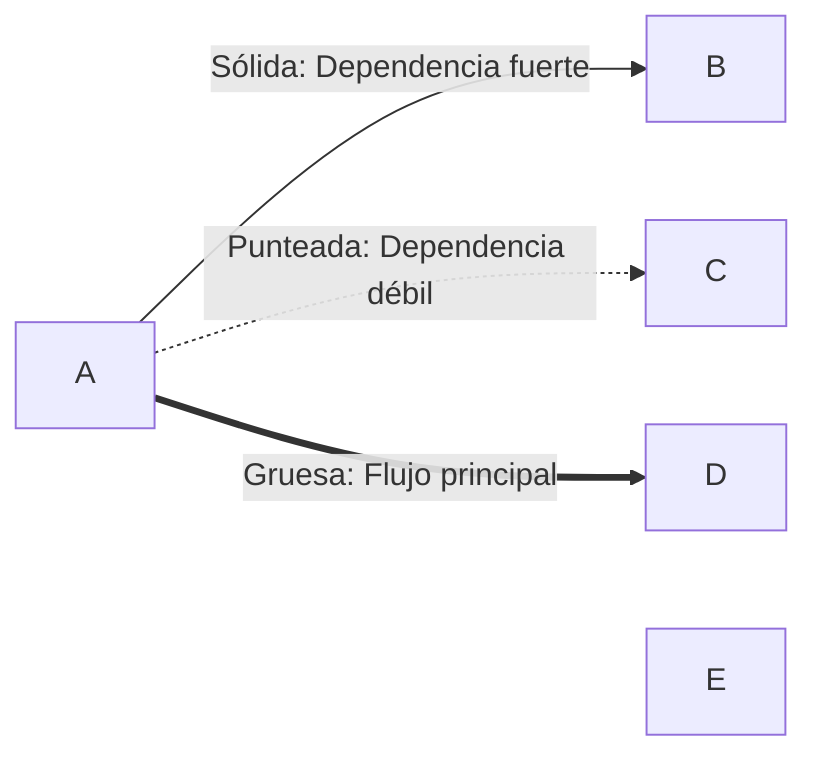
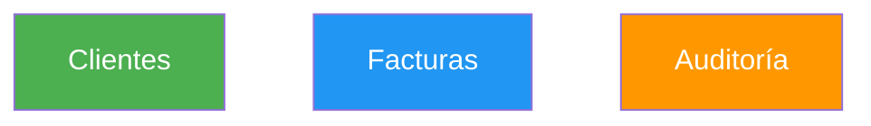
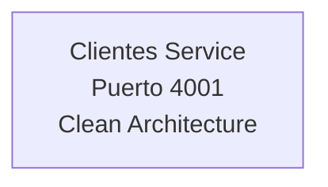
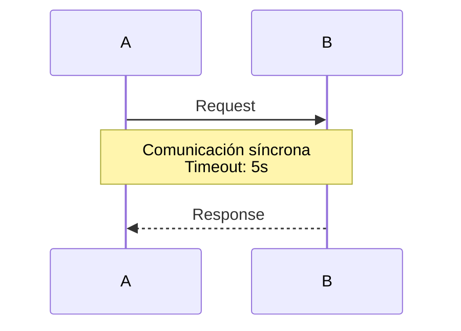
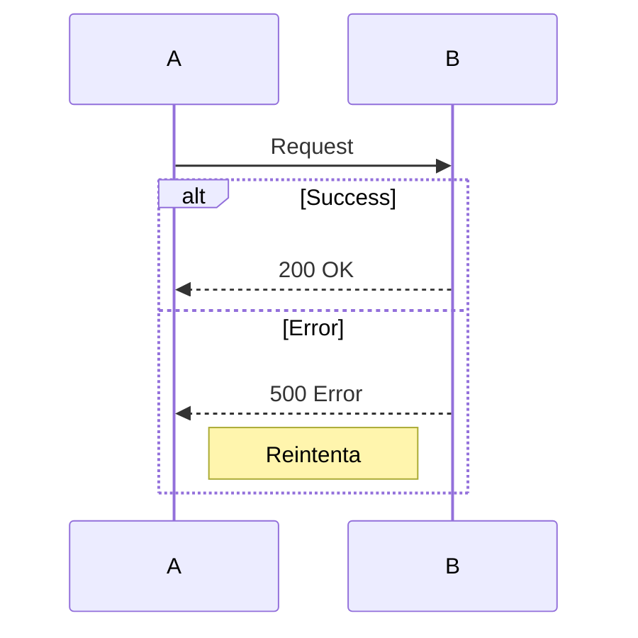
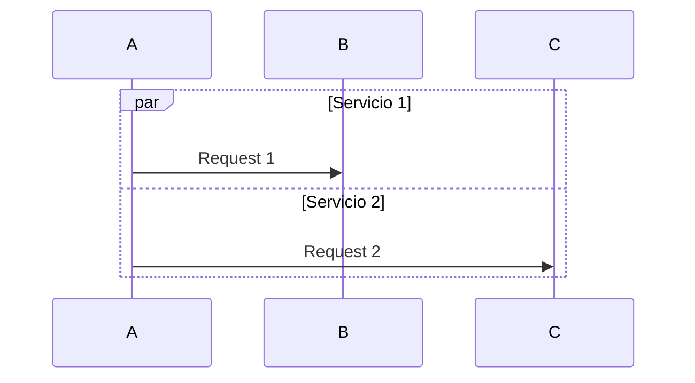

# Guía de Diagramas Mermaid - FactuMarket

Este documento explica los diagramas Mermaid utilizados en la documentación del sistema FactuMarket.

## Tipos de Diagramas Utilizados

### 1. Graph (Grafos)

Usados para mostrar arquitectura y relaciones entre componentes.

**Ejemplo - Arquitectura de Microservicios:**


**Variantes:**
- `graph TB` - Top to Bottom (vertical)
- `graph LR` - Left to Right (horizontal)
- `graph TD` - Top Down (igual que TB)

### 2. Sequence Diagrams (Diagramas de Secuencia)

Usados para mostrar flujos de comunicación entre componentes a lo largo del tiempo.

**Ejemplo - Flujo de Creación de Factura:**
```mermaid
sequenceDiagram
    autonumber
    participant Usuario
    participant Facturas as Facturas Service
    participant Clientes as Clientes Service
    participant DB as Database

    Usuario->>+Facturas: POST /facturas
    Facturas->>+Clientes: GET /clientes/:id
    Clientes-->>-Facturas: Cliente válido
    Facturas->>+DB: INSERT factura
    DB-->>-Facturas: OK
    Facturas-->>-Usuario: 201 Created

    style Facturas fill:#2196F3
    style Clientes fill:#4CAF50
```

**Elementos:**
- `participant` - Define actores/componentes
- `->>` - Llamada síncrona
- `-->>` - Respuesta
- `+` - Activación
- `-` - Desactivación
- `autonumber` - Numeración automática
- `Note` - Notas explicativas
- `alt` - Flujos alternativos
- `par` - Operaciones paralelas

### 3. Subgraphs (Subgrafos)

Usados para agrupar componentes relacionados.

**Ejemplo:**


## Paleta de Colores Utilizada

### Microservicios
- **Clientes Service**: `#4CAF50` (Verde) - `fill:#4CAF50,color:#fff`
- **Facturas Service**: `#2196F3` (Azul) - `fill:#2196F3,color:#fff`
- **Auditoría Service**: `#FF9800` (Naranja) - `fill:#FF9800,color:#fff`

### Capas de Clean Architecture
- **Presentation Layer**: `#2196F3` (Azul claro) - `fill:#E3F2FD`
- **Application Layer**: `#FF9800` (Naranja claro) - `fill:#FFF3E0`
- **Domain Layer**: `#4CAF50` (Verde claro) - `fill:#E8F5E9`
- **Infrastructure Layer**: `#9C27B0` (Púrpura claro) - `fill:#FCE4EC`

### Bases de Datos
- **SQLite/Oracle**: `#607D8B` (Gris azulado)
- **MongoDB**: `#9C27B0` (Púrpura)

## Convenciones de Nomenclatura

### Formas de Nodos



### Tipos de Flechas



## Ejemplos por Tipo de Documentación

### README Principal

**Arquitectura General del Sistema:**
- Graph TB con subgraphs
- Muestra los 3 microservicios
- Bases de datos diferenciadas
- Comunicación entre servicios

**Sequence Diagram:**
- Flujo completo de una operación
- Incluye todos los servicios involucrados
- Muestra comunicación síncrona y asíncrona

### docs/ARQUITECTURA.md

**Clean Architecture:**
- Graph TD mostrando las 4 capas
- Flujo de dependencias
- Representación de interfaces

**Comunicación entre Servicios:**
- Graph LR simple
- Focus en relaciones HTTP
- Indica si es síncrono o asíncrono

**Flujos Detallados:**
- Sequence Diagrams numerados
- Notas explicativas
- Manejo de errores con `alt`

### READMEs de Microservicios

**Arquitectura Interna:**
- Graph TD con capas específicas del servicio
- Conexiones a servicios externos
- Base de datos específica

**Integración:**
- Graph mostrando conexiones con otros servicios
- Indicadores de timeout y tipo de comunicación

**Flujos de Operación:**
- Sequence Diagrams detallados
- Validaciones y transformaciones
- Manejo de errores

## Tips para Crear Diagramas

### 1. Consistencia en Estilos

Siempre usar los mismos colores para los mismos componentes:



### 2. Claridad en Labels

Usar `<br/>` para dividir texto largo:



### 3. Notas Explicativas

Agregar contexto con `Note`:



### 4. Flujos Alternativos

Usar `alt` para mostrar errores:



### 5. Operaciones Paralelas

Usar `par` para mostrar concurrencia:



## Renderizado

Los diagramas Mermaid se renderizan automáticamente en:
- GitHub
- GitLab
- Visual Studio Code (con extensión)
- Muchos editores Markdown

Para verlos localmente:
1. Instalar extensión Mermaid para tu editor
2. O usar un previsualizador online: https://mermaid.live/

## Referencias

- [Documentación oficial de Mermaid](https://mermaid.js.org/)
- [Mermaid Live Editor](https://mermaid.live/)
- [Mermaid GitHub](https://github.com/mermaid-js/mermaid)

## Ventajas de Usar Mermaid

✅ **Versionable**: Los diagramas son texto, se pueden versionar con Git
✅ **Fácil de editar**: No necesitas herramientas gráficas
✅ **Renderizado automático**: GitHub y GitLab los muestran directamente
✅ **Consistente**: Mismo estilo en todos los diagramas
✅ **Mantenible**: Cambios rápidos sin editar imágenes
✅ **Portable**: Funciona en cualquier plataforma
