# Guía de Diagramas Mermaid - FactuMarket

Esta guía explica los diagramas Mermaid utilizados en el proyecto FactuMarket.

## Por Qué Usamos Mermaid

✅ **Versionable** - Los diagramas son código, se versionan con Git
✅ **Auto-renderizado** - GitHub/GitLab los muestran automáticamente
✅ **Fácil de editar** - Solo texto, no necesitas herramientas gráficas
✅ **Consistente** - Mismo estilo en toda la documentación

---

## Tipos de Diagramas Usados en el Proyecto

### 1. Graph (Arquitectura y Flujos)

**Uso**: Mostrar arquitectura de microservicios, capas de Clean Architecture, y relaciones entre componentes.

**Ejemplo del proyecto:**
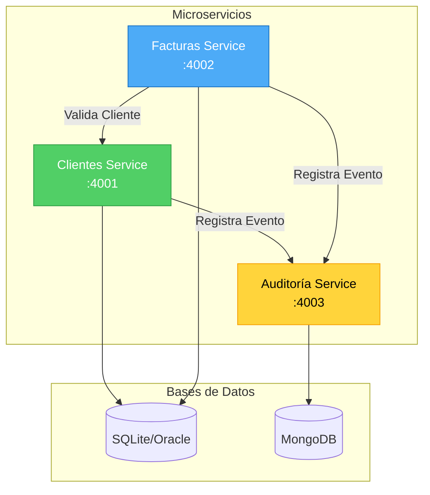

**Variantes:**
- `graph TB` - Top to Bottom (vertical)
- `graph LR` - Left to Right (horizontal)

---

### 2. Sequence Diagram (Flujos de Comunicación)

**Uso**: Mostrar flujos entre microservicios, requests HTTP, y orden de operaciones.

**Ejemplo del proyecto:**
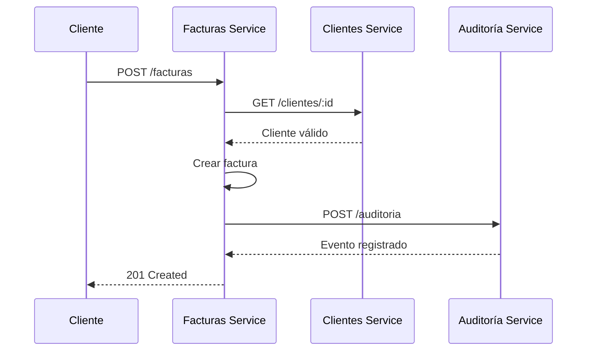

**Elementos clave:**
- `participant` - Define actores
- `->>` - Request síncrono
- `-->>` - Response
- `Note right of` - Anotaciones

---

### 3. Flowchart (Decisiones y Procesos)

**Uso**: Mostrar lógica de negocio, validaciones, y flujos de decisión.

**Ejemplo del proyecto:**
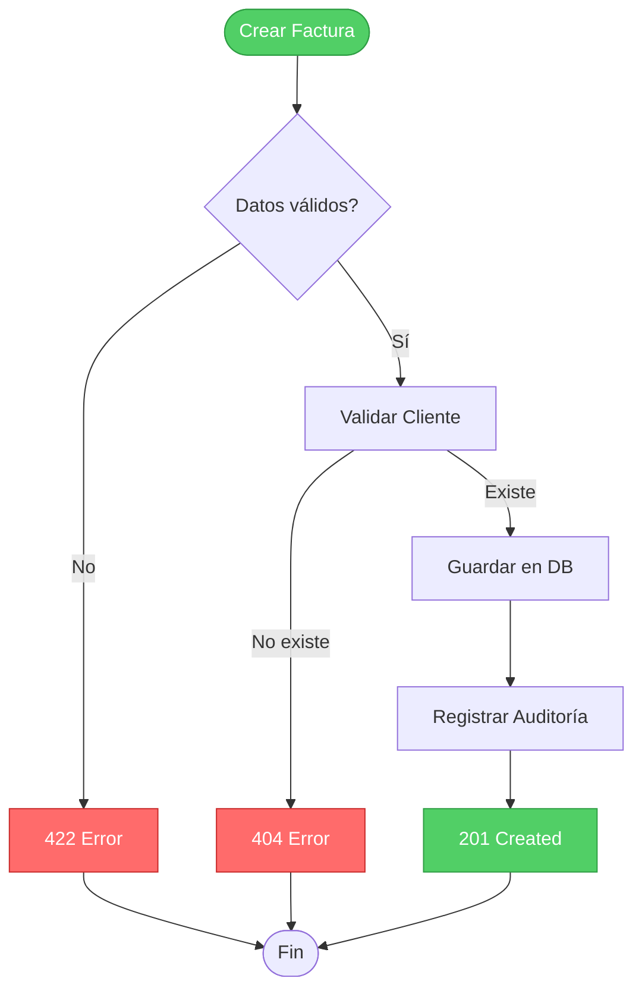

---

### 4. Mindmap (Organización de Conceptos)

**Uso**: Mostrar cobertura de tests, features del sistema, o estructura de módulos.

**Ejemplo del proyecto:**
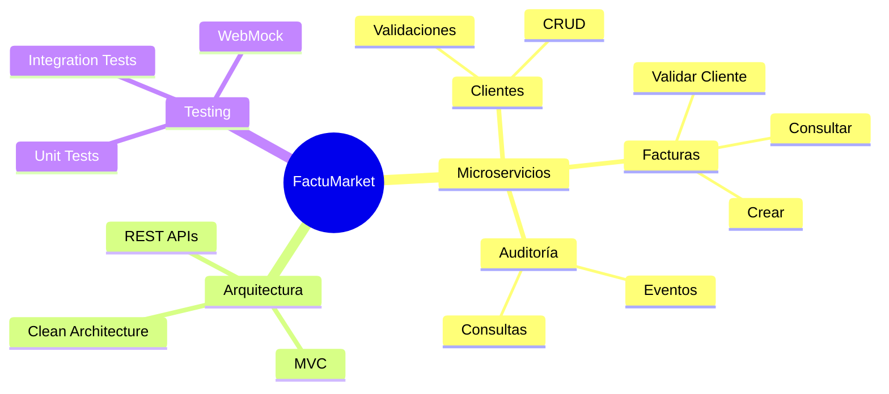

---

### 5. Pie Chart (Métricas)

**Uso**: Mostrar distribución de tests, cobertura de código, o porcentajes.

**Ejemplo del proyecto:**
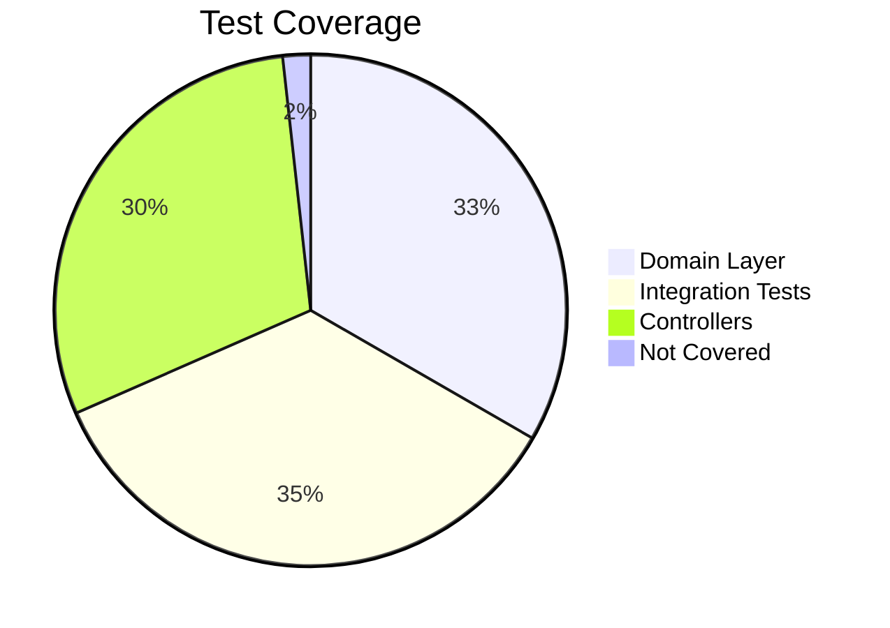

---

## Paleta de Colores del Proyecto

### Microservicios
```
Clientes:   fill:#51cf66,stroke:#2f9e44,color:#fff  (Verde)
Facturas:   fill:#4dabf7,stroke:#1971c2,color:#fff  (Azul)
Auditoría:  fill:#ffd43b,stroke:#f59f00,color:#000  (Amarillo)
```

### Estados
```
Success:  fill:#51cf66,stroke:#2f9e44,color:#fff  (Verde)
Error:    fill:#ff6b6b,stroke:#c92a2a,color:#fff  (Rojo)
Warning:  fill:#ffd43b,stroke:#f59f00,color:#000  (Amarillo)
Info:     fill:#4dabf7,stroke:#1971c2,color:#fff  (Azul)
Neutral:  fill:#ddd,stroke:#999,color:#666        (Gris)
```

### Bases de Datos
```
SQL:      fill:#ffd43b,stroke:#f59f00,color:#000  (Amarillo)
MongoDB:  fill:#ff6b6b,stroke:#c92a2a,color:#fff  (Rojo claro)
```

---

## Formas de Nodos

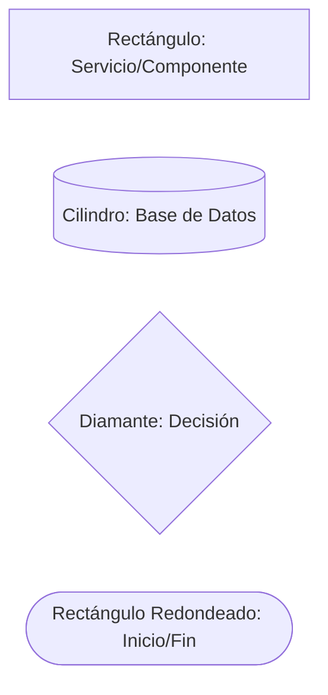

---

## Convenciones del Proyecto

### 1. Siempre Usa Colores Consistentes

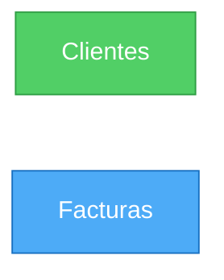

### 2. Usa Labels Claros

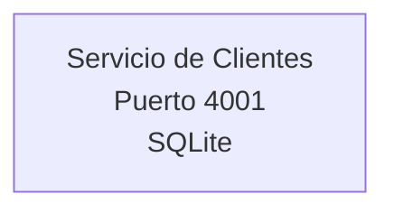

### 3. Separa con Subgraphs

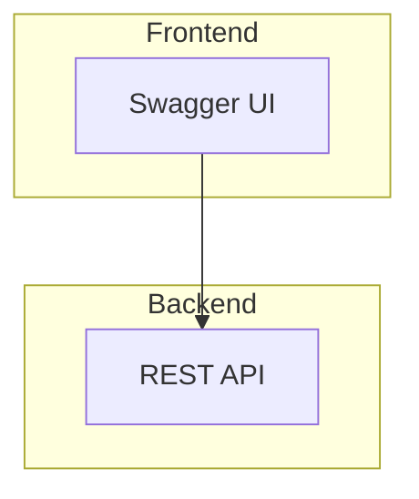

---

## Dónde Se Usan en el Proyecto

| Archivo | Diagramas | Propósito |
|---------|-----------|-----------|
| `README.md` | Graph, Sequence | Arquitectura general |
| `docs/ARQUITECTURA.md` | Graph, Sequence, Flowchart | Clean Architecture detallada |
| `docs/TESTING.md` | Graph, Sequence, Flowchart, Mindmap, Pie | Estrategia y cobertura de tests |

---

## Cómo Ver los Diagramas

### En GitHub
Los diagramas se renderizan automáticamente en archivos `.md`

### En VS Code
Instala la extensión **Markdown Preview Mermaid Support**

### Online
https://mermaid.live/ - Editor y previsualizador

---

## Plantillas Rápidas

### Arquitectura de Microservicio

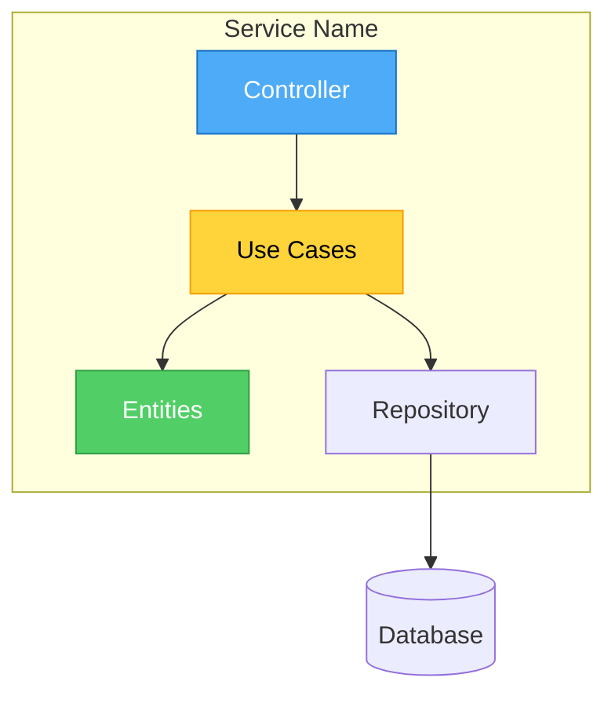

### Flujo de Request

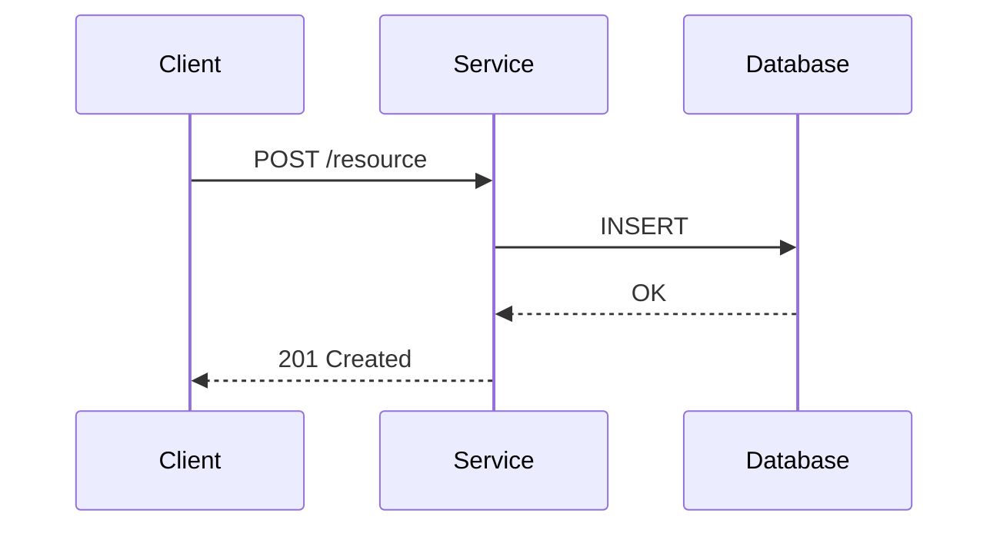

### Validación con Errores

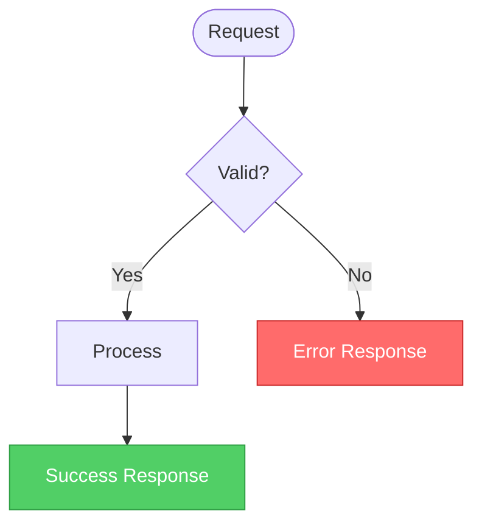

---

## Tips

1. **Mantén los diagramas simples** - Máximo 10-12 nodos
2. **Usa colores con propósito** - No solo decoración
3. **Incluye leyendas** - Si usas símbolos especiales
4. **Actualízalos** - Cuando cambie la arquitectura

---

## Referencias

- [Mermaid Docs](https://mermaid.js.org/)
- [Mermaid Live Editor](https://mermaid.live/)
- [GitHub Mermaid Support](https://github.blog/2022-02-14-include-diagrams-markdown-files-mermaid/)

---

**Última actualización:** Enero 2025
