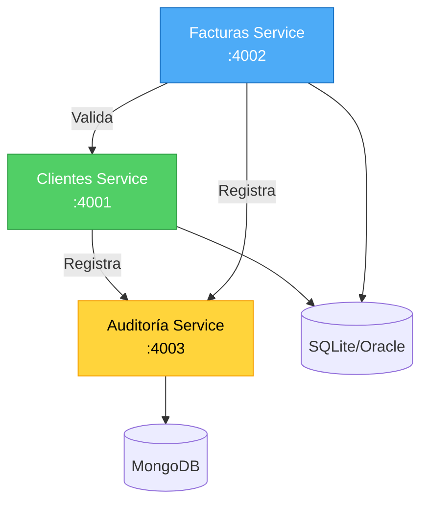
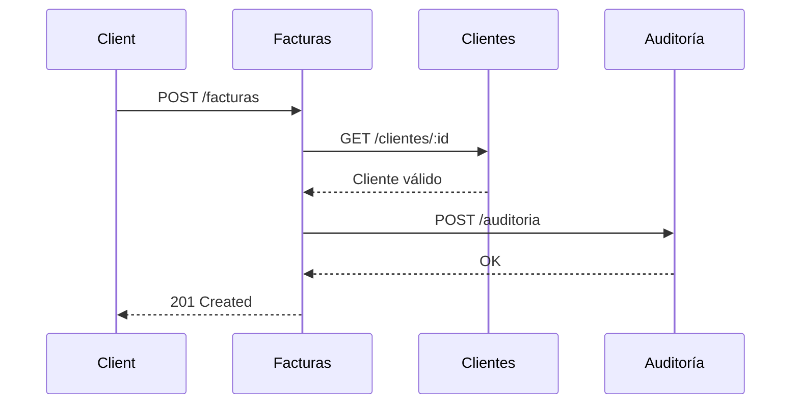
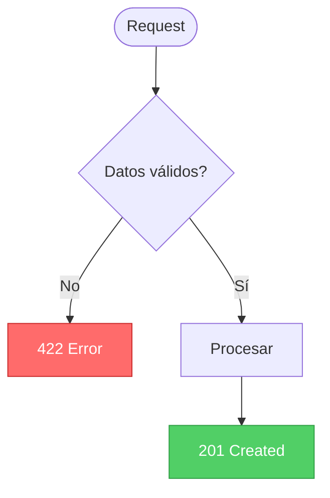

# Guía de Diagramas Mermaid - FactuMarket

Los 3 tipos de diagramas esenciales usados en el proyecto.

---

## 1. Graph - Arquitectura del Sistema

**Uso**: Mostrar componentes y sus relaciones.

**Ejemplo:**


**Variantes:**
- `graph TB` - Vertical
- `graph LR` - Horizontal

---

## 2. Sequence Diagram - Flujos de Comunicación

**Uso**: Mostrar orden de operaciones entre servicios.

**Ejemplo:**


**Elementos:**
- `->>` Request
- `-->>` Response
- `Note right of X: Texto` Anotaciones

---

## 3. Flowchart - Lógica y Decisiones

**Uso**: Mostrar validaciones y flujos de decisión.

**Ejemplo:**


**Formas:**
- `([])` Inicio/Fin
- `[]` Proceso
- `{}` Decisión

---

## Paleta de Colores

```
Verde (Success):   fill:#51cf66,stroke:#2f9e44,color:#fff
Azul (Info):       fill:#4dabf7,stroke:#1971c2,color:#fff
Amarillo (Warning): fill:#ffd43b,stroke:#f59f00,color:#000
Rojo (Error):      fill:#ff6b6b,stroke:#c92a2a,color:#fff
```

---

## Dónde Ver los Diagramas

- **GitHub**: Auto-renderizado
- **VS Code**: Extensión "Markdown Preview Mermaid Support"
- **Online**: https://mermaid.live/

---

**Documentación oficial**: https://mermaid.js.org/
