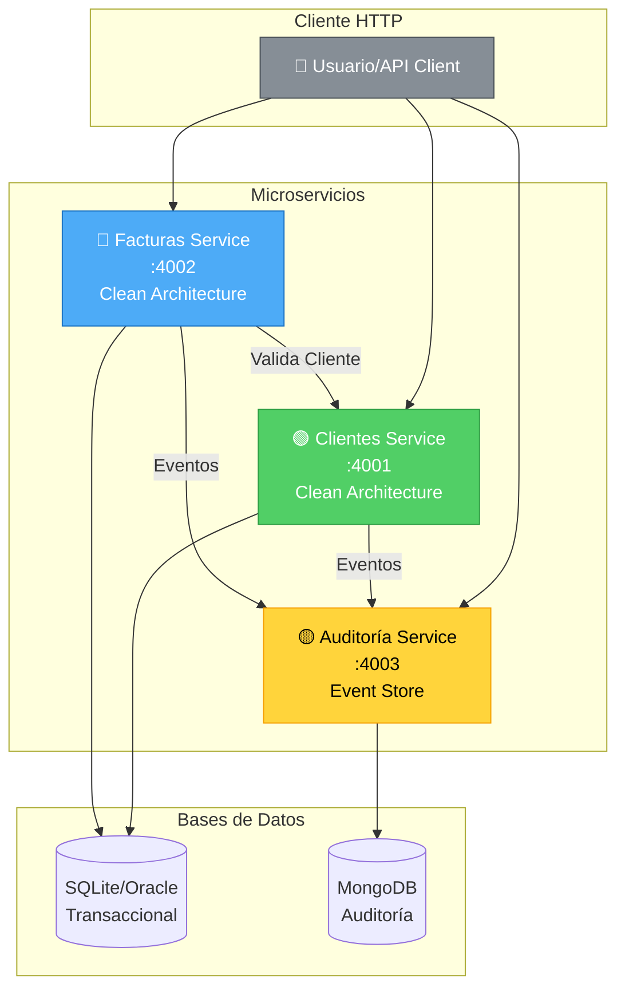
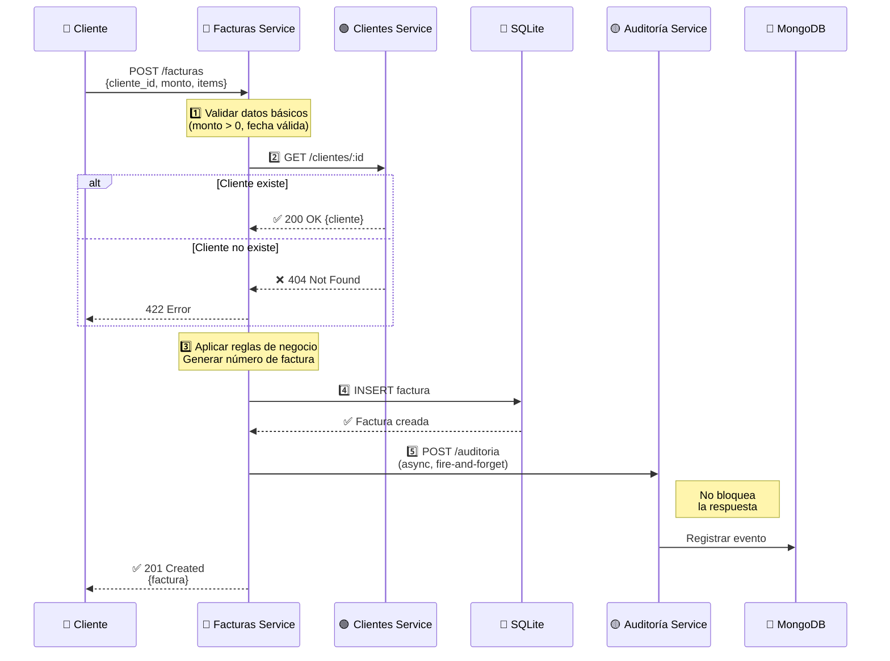
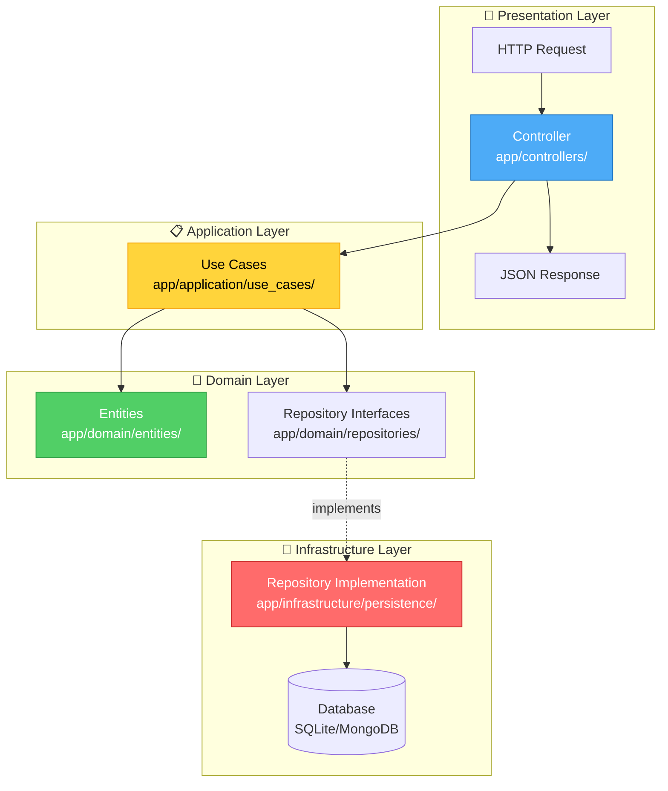
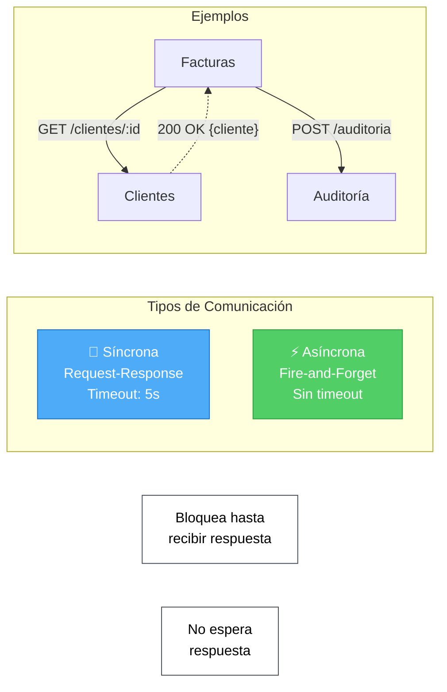

# 📊 Diagramas del Sistema - FactuMarket

> Representaciones visuales de la arquitectura, flujos y componentes del sistema.

---

## 📋 Tabla de Contenidos

- [Arquitectura General](#-arquitectura-general)
- [Flujo: Crear Factura](#-flujo-crear-factura)
- [Clean Architecture](#-clean-architecture)
- [Comunicación entre Servicios](#-comunicación-entre-servicios)

---

## 🏗️ Arquitectura General

**Características:**
- ✅ 3 microservicios independientes
- ✅ Cada servicio con su propia base de datos
- ✅ Comunicación REST entre servicios
- ✅ Auditoría asíncrona (no bloquea operaciones)

---

## 🔄 Flujo: Crear Factura

**Puntos clave:**
1. Validación en capas: datos → cliente existe → reglas de negocio
2. Comunicación síncrona para validar cliente (timeout 5s)
3. Comunicación asíncrona para auditoría (no bloquea)
4. Transacción en base de datos antes de responder

---

## 🎯 Clean Architecture

**Regla de dependencias:**
- ⬇️ Presentation → Application → Domain
- ⬆️ Domain NO depende de nada
- 🔄 Infrastructure implementa interfaces del Domain

**Beneficios:**
- ✅ Lógica de negocio independiente de frameworks
- ✅ Fácil testing unitario (sin dependencias externas)
- ✅ Cambiar BD o framework sin afectar lógica

---

## 🌐 Comunicación entre Servicios

| Tipo | Uso | Timeout | Bloquea | Manejo de Error |
|------|-----|---------|---------|-----------------|
| **Síncrona** | Validar cliente antes de crear factura | 5s | ✅ Sí | Devuelve error al cliente |
| **Asíncrona** | Registrar evento de auditoría | - | ❌ No | Continúa aunque falle |

---

## 📝 Notas

- **Ver diagramas en vivo**: Los diagramas Mermaid se renderizan automáticamente en GitHub
- **Editor local**: Usar extensión "Markdown Preview Mermaid Support" en VS Code
- **Probar cambios**: https://mermaid.live/

---

**📚 Documentación relacionada:**
- [Arquitectura](ARQUITECTURA.md) - Detalles técnicos de la arquitectura
- [Uso del Sistema](USO%20DEL%20SISTEMA.md) - Cómo usar las APIs
- [Testing](TESTING.md) - Pruebas unitarias e integración
