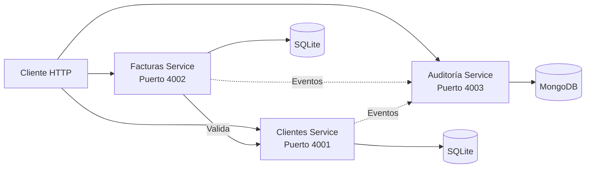
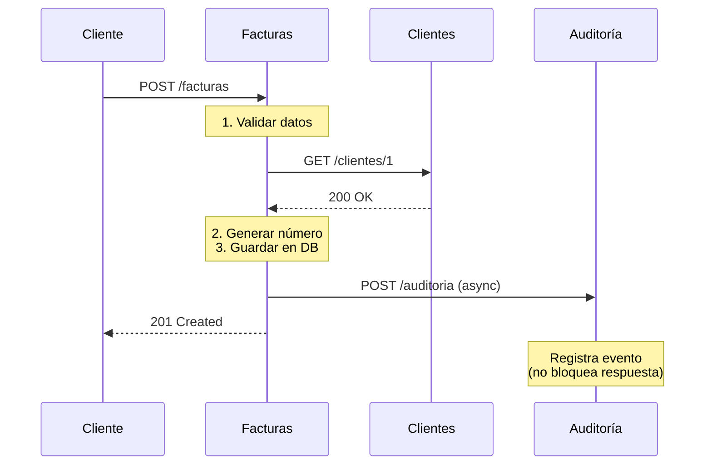
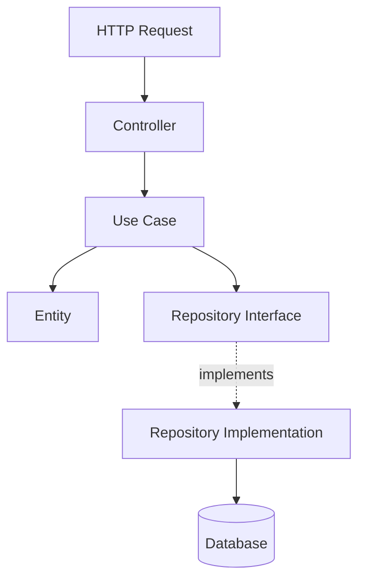
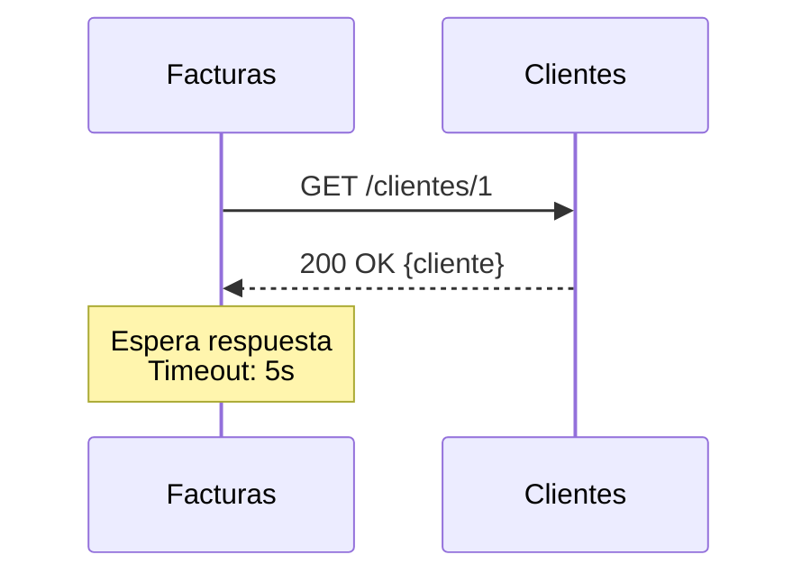
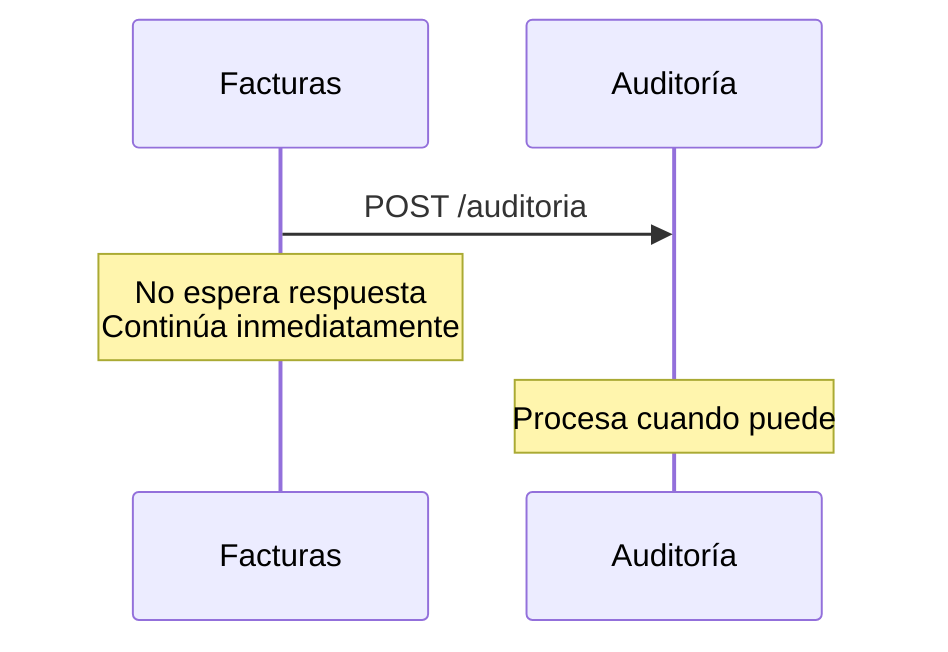

# 📊 Diagramas del Sistema - FactuMarket

> Representaciones visuales de la arquitectura, flujos y componentes del sistema.

---

## 📋 Tabla de Contenidos

- [Arquitectura General](#-arquitectura-general)
- [Flujo: Crear Factura](#-flujo-crear-factura)
- [Clean Architecture](#-clean-architecture)
- [Comunicación entre Servicios](#-comunicación-entre-servicios)

---

## 🏗️ Arquitectura General



**Leyenda:**
- Línea sólida (→): Comunicación síncrona
- Línea punteada (⋯→): Comunicación asíncrona

**Características:**
- 3 microservicios independientes
- Cada servicio con su propia base de datos
- Facturas valida clientes antes de crear
- Auditoría registra eventos sin bloquear operaciones

---

## 🔄 Flujo: Crear Factura



**Flujo simplificado:**

1. **Validar datos**: Monto > 0, fecha válida, items completos
2. **Verificar cliente**: Consulta síncrona al servicio de Clientes
3. **Crear factura**: Generar número único y guardar en BD
4. **Registrar evento**: Envío asíncrono a Auditoría (fire-and-forget)
5. **Responder**: 201 Created con datos de la factura

**Puntos clave:**
- Validación síncrona del cliente (timeout 5s)
- Auditoría asíncrona (no bloquea la respuesta)
- Transacción en BD antes de responder al cliente

---

## 🎯 Clean Architecture



**Capas del sistema (de afuera hacia adentro):**

1. **Presentation** → Controllers (HTTP → JSON)
2. **Application** → Use Cases (lógica de orquestación)
3. **Domain** → Entities + Repository Interfaces (reglas de negocio)
4. **Infrastructure** → Repository Implementations (acceso a BD)

**Regla de dependencias:**
- Las capas externas dependen de las internas
- El Domain NO depende de nada
- Infrastructure implementa interfaces del Domain

**Ejemplo práctico:**
```
POST /facturas
  → Controller recibe request
  → Llama a Use Case "CrearFactura"
  → Use Case valida con Entity "Factura"
  → Use Case usa FacturaRepository (interfaz)
  → FacturaRepositoryImpl guarda en SQLite
  → Controller devuelve JSON
```

**Beneficios:**
- Lógica de negocio independiente de frameworks
- Testing fácil (mock de repositories)
- Cambiar BD sin afectar lógica de negocio

---

## 🌐 Comunicación entre Servicios

### Comunicación Síncrona



**Cuándo usar:**
- Cuando necesitas el resultado para continuar
- Ejemplo: Validar que un cliente existe antes de crear factura

**Características:**
- Bloquea hasta recibir respuesta
- Timeout de 5 segundos
- Si falla, devuelve error al usuario

### Comunicación Asíncrona



**Cuándo usar:**
- Cuando no necesitas el resultado inmediatamente
- Ejemplo: Registrar eventos de auditoría

**Características:**
- No bloquea la operación principal
- Fire-and-forget (dispara y olvida)
- Si falla, no afecta al usuario

### Comparación

| Aspecto | Síncrona | Asíncrona |
|---------|----------|-----------|
| **Bloquea** | Sí | No |
| **Timeout** | 5 segundos | N/A |
| **Uso** | Validar cliente | Registrar eventos |
| **Si falla** | Error al usuario | Continúa operación |

---

## 📝 Notas

- **Ver diagramas en vivo**: Los diagramas Mermaid se renderizan automáticamente en GitHub
- **Editor local**: Usar extensión "Markdown Preview Mermaid Support" en VS Code
- **Probar cambios**: https://mermaid.live/

---

**📚 Documentación relacionada:**
- [Arquitectura](ARQUITECTURA.md) - Detalles técnicos de la arquitectura
- [Uso del Sistema](USO%20DEL%20SISTEMA.md) - Cómo usar las APIs
- [Testing](TESTING.md) - Pruebas unitarias e integración
