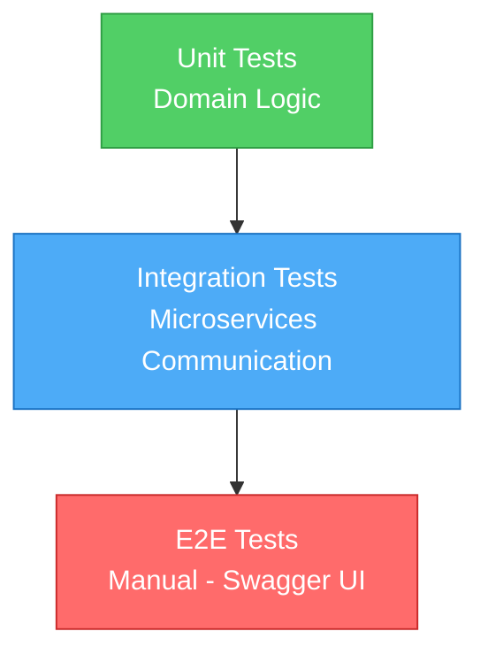
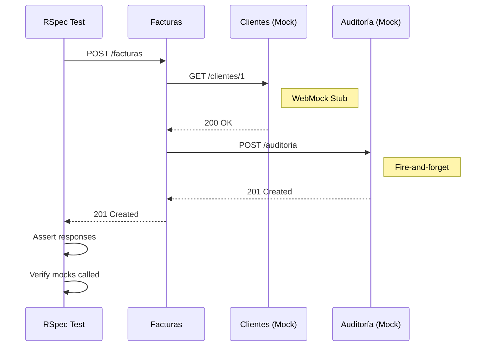

# Guía de Testing - FactuMarket

Estrategia de testing en dos niveles: unitarios e integración.

---

## Estrategia de Testing



**Distribución:**
- 🟢 70% Unit Tests - Rápidos, sin dependencias
- 🔵 20% Integration Tests - HTTP mocks, flujos completos
- 🔴 10% E2E Tests - Manual via Swagger UI

---

## Pruebas Unitarias

**Objetivo:** Validar lógica de dominio sin dependencias externas.

**Ubicación:**
```
clientes-service/spec/domain/
facturas-service/spec/domain/
```

**Ejemplo:**
```ruby
RSpec.describe Domain::Entities::Cliente do
  it 'creates a cliente successfully' do
    cliente = described_class.new(
      nombre: 'Empresa ABC',
      identificacion: '900123456',
      correo: 'test@example.com',
      direccion: 'Calle 123'
    )

    expect(cliente.nombre).to eq('Empresa ABC')
  end

  it 'raises error when nombre is empty' do
    expect {
      described_class.new(nombre: '', identificacion: '900123456')
    }.to raise_error(ArgumentError, 'Nombre es requerido')
  end
end
```

**Ejecutar:**
```bash
cd clientes-service
bundle exec rspec spec/domain/
```

---

## Pruebas de Integración

**Objetivo:** Validar comunicación entre microservicios.

**Ubicación:**
```
clientes-service/spec/integration/
facturas-service/spec/integration/
```

### Flujo de Test de Integración



### Casos de Prueba Cubiertos

**Clientes → Auditoría:**
- ✅ Creación exitosa + registro en auditoría
- ✅ Validación fallida + error en auditoría
- ✅ Resiliencia cuando auditoría falla
- ✅ Operaciones de lectura y listado

**Facturas → Clientes → Auditoría:**
- ✅ Flujo completo: validar cliente → crear factura → registrar evento
- ✅ Rechazo cuando cliente no existe (404)
- ✅ Validaciones de negocio (monto > 0, fecha válida)
- ✅ Filtrado por rango de fechas
- ✅ Timeout de servicios externos
- ✅ Circuit breaker (auditoría no bloquea)

### Ejemplo de Test

```ruby
RSpec.describe 'Integration: Facturas → Clientes → Auditoría' do
  it 'creates factura with valid cliente' do
    # Mock Clientes service
    stub_request(:get, "#{clientes_url}/clientes/1")
      .to_return(status: 200, body: { success: true, data: {...} }.to_json)

    # Mock Auditoría service
    audit_stub = stub_request(:post, "#{auditoria_url}/auditoria")
      .to_return(status: 201)

    # Create factura
    post '/facturas', { cliente_id: 1, monto: 1500000 }.to_json

    # Verify
    expect(last_response.status).to eq(201)
    expect(audit_stub).to have_been_requested.once
  end
end
```

**Ejecutar:**
```bash
cd facturas-service
bundle exec rspec spec/integration/
```

---

## Stack de Testing

| Herramienta | Uso |
|-------------|-----|
| RSpec | Framework de testing |
| Rack::Test | Testing de endpoints HTTP |
| WebMock | Mock de llamadas HTTP entre servicios |
| DatabaseCleaner | Aislamiento de BD entre tests |
| FactoryBot | Generación de datos de prueba |

---

## Comandos Útiles

```bash
# Tests unitarios
bundle exec rspec spec/domain/

# Tests de integración
bundle exec rspec spec/integration/

# Todos los tests
bundle exec rspec

# Test específico
bundle exec rspec spec/integration/clientes_spec.rb:10

# Con formato detallado
bundle exec rspec --format documentation

# Todos los servicios (desde raíz)
./scripts/test.sh
```

---

## Métricas Actuales

| Servicio | Unit Tests | Integration Tests | Total |
|----------|------------|-------------------|-------|
| Clientes | 8 | 6 | 14 |
| Facturas | 8 | 9 | 17 |
| **Total** | **16** | **15** | **31** |

**Cobertura:** ~95% de domain layer, 100% de flujos de integración

---

**Última actualización:** Enero 2025
