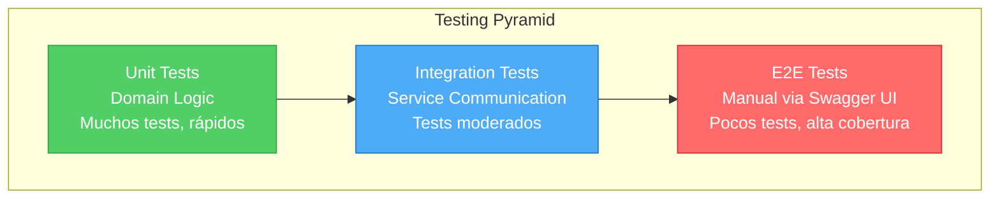
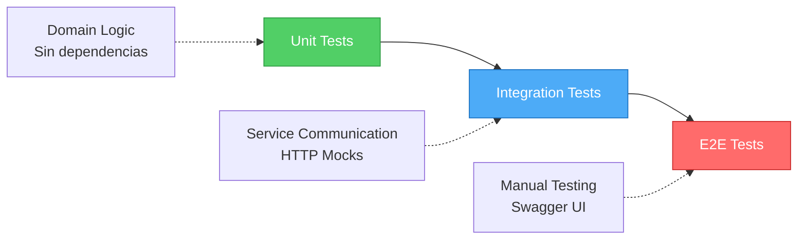
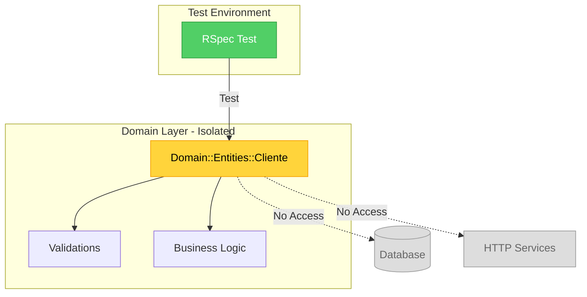
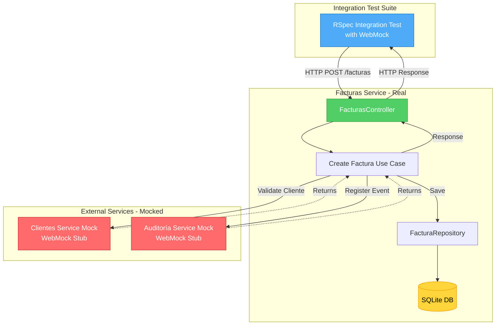
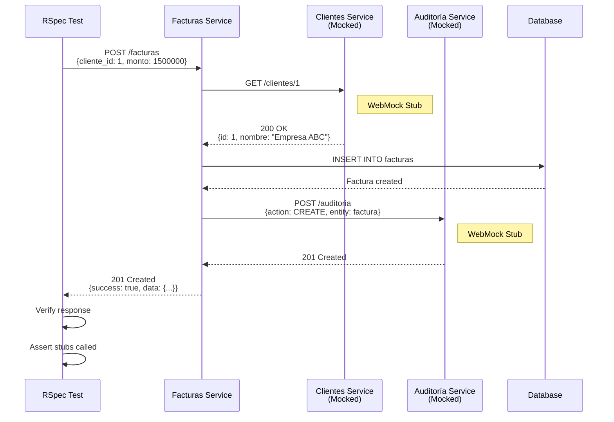
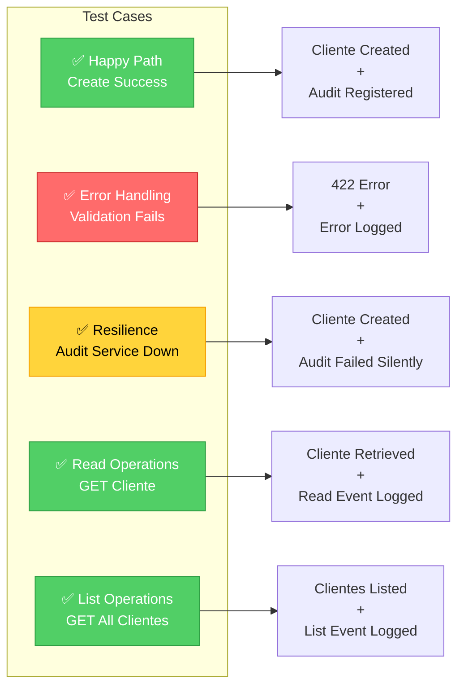
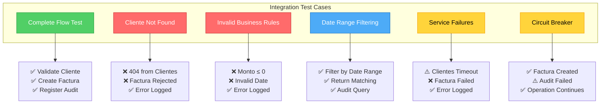

# Guía de Testing - FactuMarket

## Índice

- [Estrategia de Testing](#estrategia-de-testing)
- [Pruebas Unitarias](#pruebas-unitarias)
- [Pruebas de Integración](#pruebas-de-integración)
- [Ejecución de Tests](#ejecución-de-tests)
- [Mocking y Stubs](#mocking-y-stubs)
- [Buenas Prácticas](#buenas-prácticas)

---

## Estrategia de Testing

El proyecto FactuMarket implementa una **estrategia de testing en pirámide**:



### Niveles de Testing



**Distribución de Tests:**

- 🟢 **70%** - Unit Tests (Base)
- 🔵 **20%** - Integration Tests (Medio)
- 🔴 **10%** - E2E Tests (Tope)

---

## Pruebas Unitarias

### Objetivo

Validar la lógica de dominio sin dependencias externas (bases de datos, HTTP, etc.).

### Arquitectura de Tests Unitarios



### Ubicación

```
clientes-service/spec/domain/
facturas-service/spec/domain/
```

### Ejemplo: Test de Entidad Cliente

```ruby
# spec/domain/entities/cliente_spec.rb
RSpec.describe Domain::Entities::Cliente do
  describe '#initialize' do
    context 'with valid attributes' do
      it 'creates a cliente successfully' do
        cliente = described_class.new(
          nombre: 'Empresa ABC S.A.',
          identificacion: '900123456',
          correo: 'contacto@empresaabc.com',
          direccion: 'Calle 123 #45-67'
        )

        expect(cliente.nombre).to eq('Empresa ABC S.A.')
        expect(cliente.identificacion).to eq('900123456')
      end
    end

    context 'with invalid attributes' do
      it 'raises ArgumentError when nombre is empty' do
        expect {
          described_class.new(
            nombre: '',
            identificacion: '900123456',
            correo: 'contacto@empresaabc.com',
            direccion: 'Calle 123'
          )
        }.to raise_error(ArgumentError, 'Nombre es requerido')
      end
    end
  end
end
```

### Ejecución

```bash
cd clientes-service
bundle exec rspec spec/domain/

# Salida esperada:
# Domain::Entities::Cliente
#   #initialize
#     with valid attributes
#       ✓ creates a cliente successfully
#     with invalid attributes
#       ✓ raises ArgumentError when nombre is empty
```

---

## Pruebas de Integración

### Objetivo

Validar la **comunicación entre microservicios** y el flujo completo de operaciones.

### Ubicación

```
clientes-service/spec/integration/
facturas-service/spec/integration/
```

### Arquitectura de Tests de Integración



### Flujo Completo: Crear Factura



### Casos de Prueba: Cliente → Auditoría



### Casos de Prueba: Factura → Cliente → Auditoría



### Ejemplo: Test de Flujo Completo

```ruby
# spec/integration/facturas_clientes_auditoria_integration_spec.rb
RSpec.describe 'Integration: Facturas → Clientes → Auditoría' do
  let(:clientes_url) { ENV['CLIENTES_SERVICE_URL'] }
  let(:auditoria_url) { ENV['AUDITORIA_SERVICE_URL'] }

  describe 'POST /facturas - Complete flow' do
    it 'validates cliente, creates factura, and registers audit events' do
      # Step 1: Mock Clientes service - validate cliente exists
      cliente_stub = stub_request(:get, "#{clientes_url}/clientes/1")
        .to_return(
          status: 200,
          body: {
            success: true,
            data: {
              id: 1,
              nombre: 'Empresa ABC S.A.',
              identificacion: '900123456'
            }
          }.to_json
        )

      # Step 2: Mock Auditoría service - register event
      audit_stub = stub_request(:post, "#{auditoria_url}/auditoria")
        .with(
          body: hash_including(
            entity_type: 'factura',
            action: 'CREATE',
            status: 'SUCCESS'
          )
        )
        .to_return(status: 201, body: { success: true }.to_json)

      # Step 3: Create factura
      post '/facturas', {
        cliente_id: 1,
        fecha_emision: Date.today.to_s,
        monto: 1500000
      }.to_json, { 'CONTENT_TYPE' => 'application/json' }

      # Verify response
      expect(last_response.status).to eq(201)

      # Verify service interactions
      expect(cliente_stub).to have_been_requested.once
      expect(audit_stub).to have_been_requested.once
    end
  end
end
```

---

**Versión:** 1.0
**Última actualización:** Enero 2025
**Autor:** Justin Hernandez
