# Guía de Testing - FactuMarket

## Índice

- [Estrategia de Testing](#estrategia-de-testing)
- [Pruebas Unitarias](#pruebas-unitarias)
- [Pruebas de Integración](#pruebas-de-integración)
- [Ejecución de Tests](#ejecución-de-tests)
- [Mocking y Stubs](#mocking-y-stubs)
- [Buenas Prácticas](#buenas-prácticas)

---

## Estrategia de Testing

El proyecto FactuMarket implementa una **estrategia de testing en pirámide**:

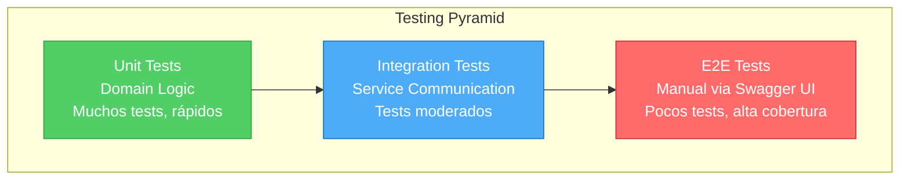

### Niveles de Testing

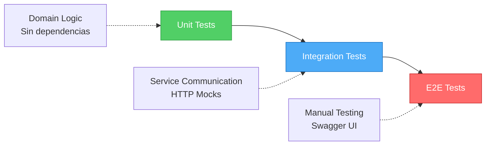

**Distribución de Tests:**
- 🟢 **70%** - Unit Tests (Base)
- 🔵 **20%** - Integration Tests (Medio)
- 🔴 **10%** - E2E Tests (Tope)

---

## Pruebas Unitarias

### Objetivo

Validar la lógica de dominio sin dependencias externas (bases de datos, HTTP, etc.).

### Arquitectura de Tests Unitarios

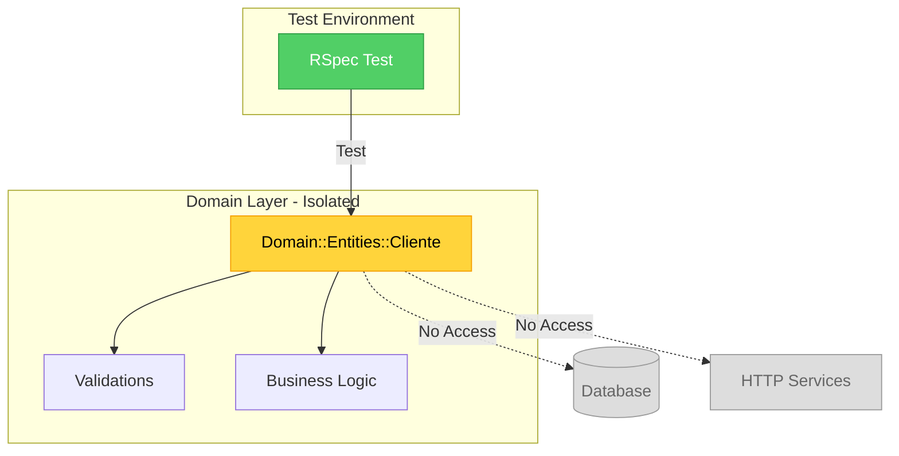

### Ubicación

```
clientes-service/spec/domain/
facturas-service/spec/domain/
```

### Ejemplo: Test de Entidad Cliente

```ruby
# spec/domain/entities/cliente_spec.rb
RSpec.describe Domain::Entities::Cliente do
  describe '#initialize' do
    context 'with valid attributes' do
      it 'creates a cliente successfully' do
        cliente = described_class.new(
          nombre: 'Empresa ABC S.A.',
          identificacion: '900123456',
          correo: 'contacto@empresaabc.com',
          direccion: 'Calle 123 #45-67'
        )

        expect(cliente.nombre).to eq('Empresa ABC S.A.')
        expect(cliente.identificacion).to eq('900123456')
      end
    end

    context 'with invalid attributes' do
      it 'raises ArgumentError when nombre is empty' do
        expect {
          described_class.new(
            nombre: '',
            identificacion: '900123456',
            correo: 'contacto@empresaabc.com',
            direccion: 'Calle 123'
          )
        }.to raise_error(ArgumentError, 'Nombre es requerido')
      end
    end
  end
end
```

### Ejecución

```bash
cd clientes-service
bundle exec rspec spec/domain/

# Salida esperada:
# Domain::Entities::Cliente
#   #initialize
#     with valid attributes
#       ✓ creates a cliente successfully
#     with invalid attributes
#       ✓ raises ArgumentError when nombre is empty
```

---

## Pruebas de Integración

### Objetivo

Validar la **comunicación entre microservicios** y el flujo completo de operaciones.

### Ubicación

```
clientes-service/spec/integration/
facturas-service/spec/integration/
```

### Arquitectura de Tests de Integración

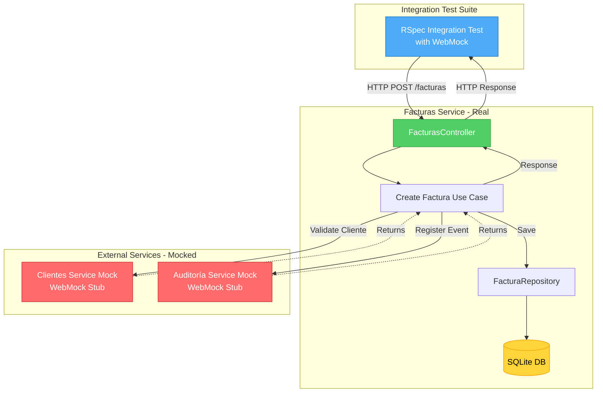

### Flujo Completo: Crear Factura

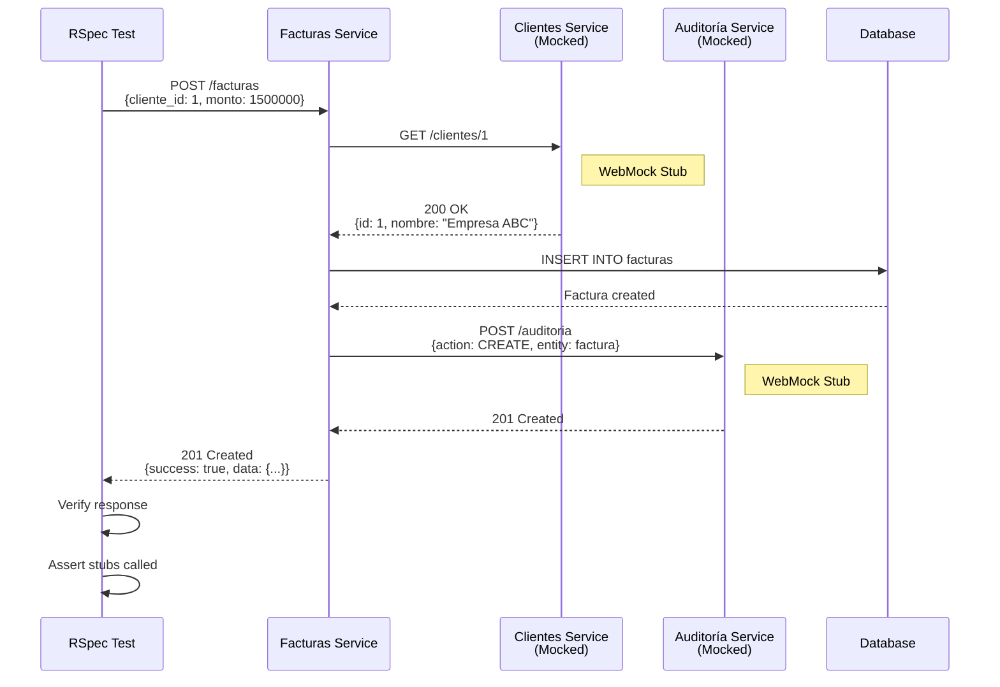

### Casos de Prueba: Cliente → Auditoría

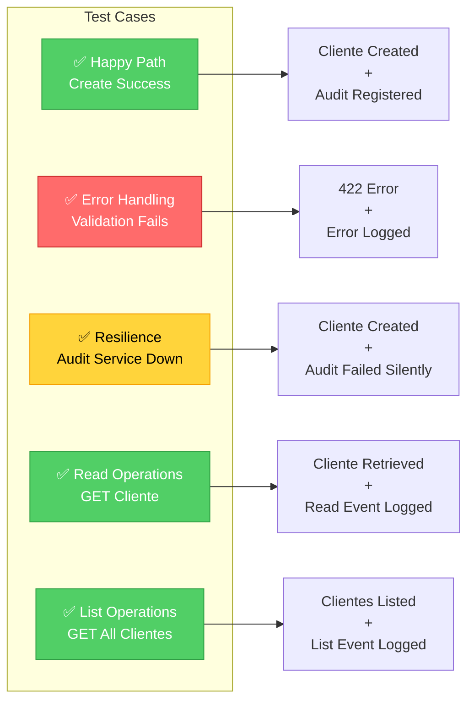

### Casos de Prueba: Factura → Cliente → Auditoría

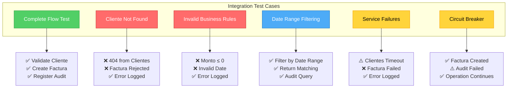

### Ejemplo: Test de Flujo Completo

```ruby
# spec/integration/facturas_clientes_auditoria_integration_spec.rb
RSpec.describe 'Integration: Facturas → Clientes → Auditoría' do
  let(:clientes_url) { ENV['CLIENTES_SERVICE_URL'] }
  let(:auditoria_url) { ENV['AUDITORIA_SERVICE_URL'] }

  describe 'POST /facturas - Complete flow' do
    it 'validates cliente, creates factura, and registers audit events' do
      # Step 1: Mock Clientes service - validate cliente exists
      cliente_stub = stub_request(:get, "#{clientes_url}/clientes/1")
        .to_return(
          status: 200,
          body: {
            success: true,
            data: {
              id: 1,
              nombre: 'Empresa ABC S.A.',
              identificacion: '900123456'
            }
          }.to_json
        )

      # Step 2: Mock Auditoría service - register event
      audit_stub = stub_request(:post, "#{auditoria_url}/auditoria")
        .with(
          body: hash_including(
            entity_type: 'factura',
            action: 'CREATE',
            status: 'SUCCESS'
          )
        )
        .to_return(status: 201, body: { success: true }.to_json)

      # Step 3: Create factura
      post '/facturas', {
        cliente_id: 1,
        fecha_emision: Date.today.to_s,
        monto: 1500000
      }.to_json, { 'CONTENT_TYPE' => 'application/json' }

      # Verify response
      expect(last_response.status).to eq(201)

      # Verify service interactions
      expect(cliente_stub).to have_been_requested.once
      expect(audit_stub).to have_been_requested.once
    end
  end
end
```

### Cobertura Completa de Tests

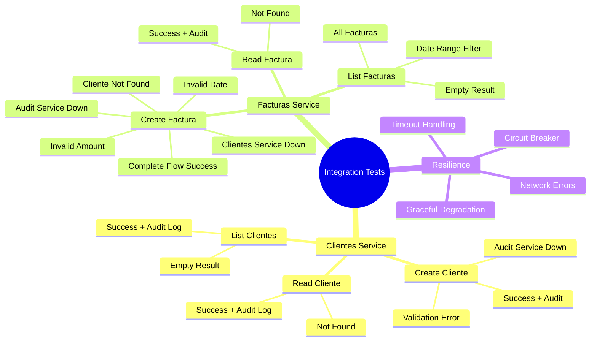

### Ejecución

```bash
# Test Clientes → Auditoría
cd clientes-service
bundle exec rspec spec/integration/

# Test Facturas → Clientes → Auditoría
cd facturas-service
bundle exec rspec spec/integration/
```

---

## Ejecución de Tests

### Flujo de Ejecución

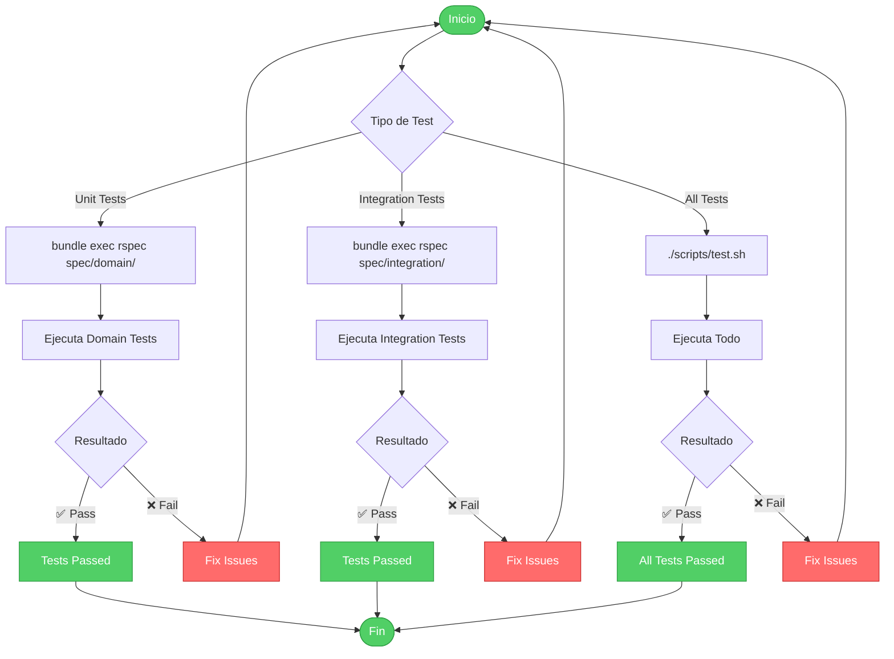

### Comandos de Ejecución

```bash
# Un test específico
bundle exec rspec spec/domain/entities/cliente_spec.rb

# Un contexto específico (por línea)
bundle exec rspec spec/domain/entities/cliente_spec.rb:22

# Tests por tipo
bundle exec rspec spec/domain/      # Solo unitarios
bundle exec rspec spec/integration/ # Solo integración

# Todos los tests con formato detallado
bundle exec rspec --format documentation

# Todos los tests del proyecto
chmod +x scripts/test.sh
./scripts/test.sh
```

---

## Mocking y Stubs

### Arquitectura de WebMock

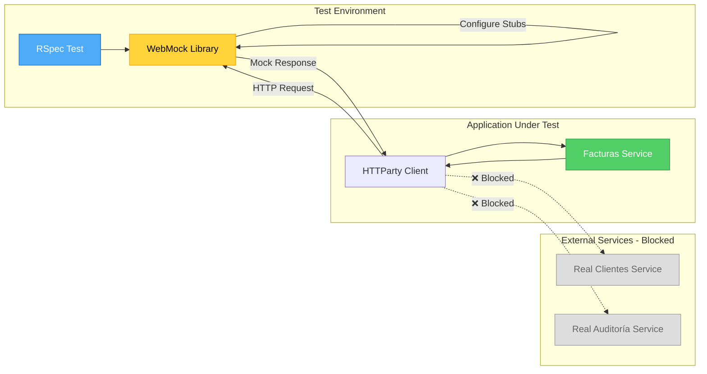

### Tipos de Mocks

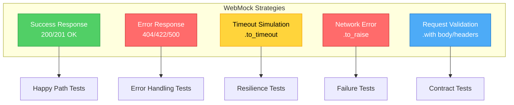

### Ejemplos de WebMock

```ruby
# 1. Mock Success Response
stub_request(:get, "http://localhost:4001/clientes/1")
  .to_return(
    status: 200,
    body: { success: true, data: { id: 1, nombre: 'Test' } }.to_json,
    headers: { 'Content-Type' => 'application/json' }
  )

# 2. Mock con validación de request body
stub_request(:post, "http://localhost:4003/auditoria")
  .with(
    body: hash_including(
      entity_type: 'cliente',
      action: 'CREATE',
      status: 'SUCCESS'
    ),
    headers: { 'Content-Type' => 'application/json' }
  )
  .to_return(status: 201, body: { success: true }.to_json)

# 3. Mock de timeout
stub_request(:get, "http://localhost:4001/clientes/1")
  .to_timeout

# 4. Mock de error de red
stub_request(:get, "http://localhost:4001/clientes/1")
  .to_raise(SocketError.new('Network unreachable'))

# 5. Mock con captura de request
audit_request = nil
stub_request(:post, "http://localhost:4003/auditoria")
  .to_return do |request|
    audit_request = JSON.parse(request.body)
    { status: 201, body: { success: true }.to_json }
  end

# Luego verificar
expect(audit_request[:action]).to eq('CREATE')
```

### DatabaseCleaner Strategy

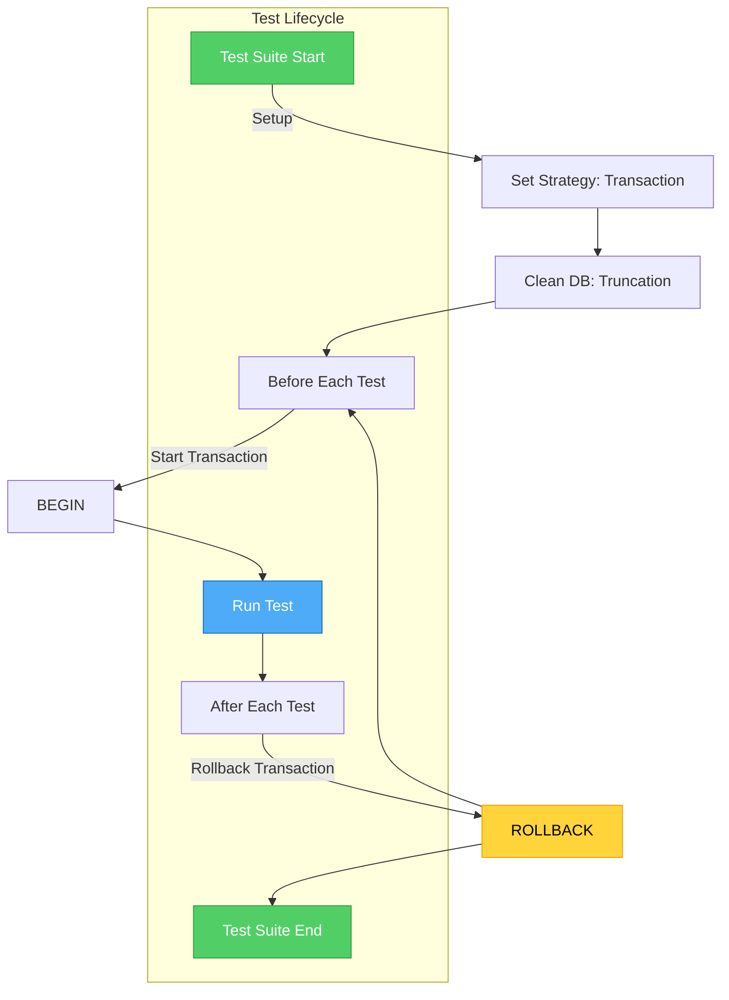

```ruby
RSpec.configure do |config|
  # Configuración inicial
  config.before(:suite) do
    DatabaseCleaner.strategy = :transaction
    DatabaseCleaner.clean_with(:truncation)
  end

  # Wrap cada test en una transacción
  config.around(:each) do |example|
    DatabaseCleaner.cleaning do
      example.run  # Se ejecuta dentro de una transacción
    end            # Auto-rollback al terminar
  end
end
```

---

## Buenas Prácticas

### Patrón AAA (Arrange-Act-Assert)

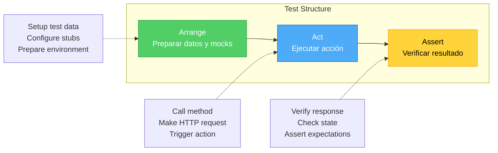

```ruby
it 'creates a cliente successfully' do
  # 🟢 Arrange: Preparar datos
  cliente_params = {
    nombre: 'Test',
    identificacion: '900123456',
    correo: 'test@example.com'
  }

  stub_request(:post, "#{audit_url}/auditoria")
    .to_return(status: 201)

  # 🔵 Act: Ejecutar acción
  post '/clientes', cliente_params.to_json

  # 🟡 Assert: Verificar resultado
  expect(last_response.status).to eq(201)
  expect(JSON.parse(last_response.body)[:success]).to be true
end
```

### Organización de Tests

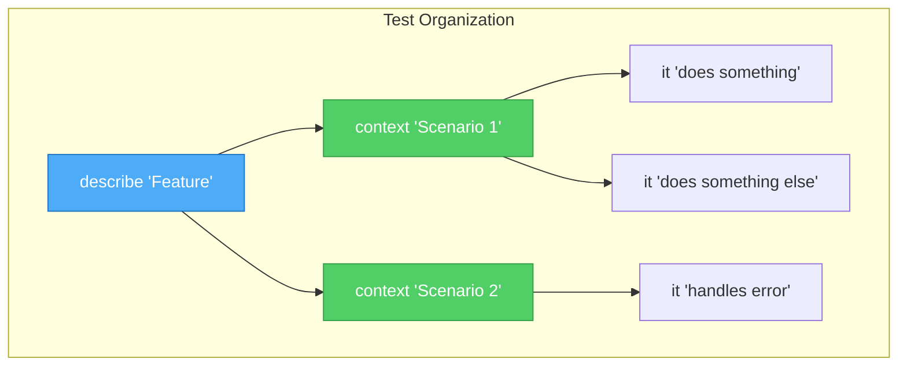

```ruby
describe 'POST /facturas' do
  context 'when cliente exists' do
    it 'creates factura successfully' do
      # ...
    end

    it 'registers audit event' do
      # ...
    end
  end

  context 'when cliente does not exist' do
    it 'returns 422 error' do
      # ...
    end

    it 'logs error in audit' do
      # ...
    end
  end

  context 'when auditoría service is down' do
    it 'still creates factura' do
      # ...
    end
  end
end
```

### Principios FIRST

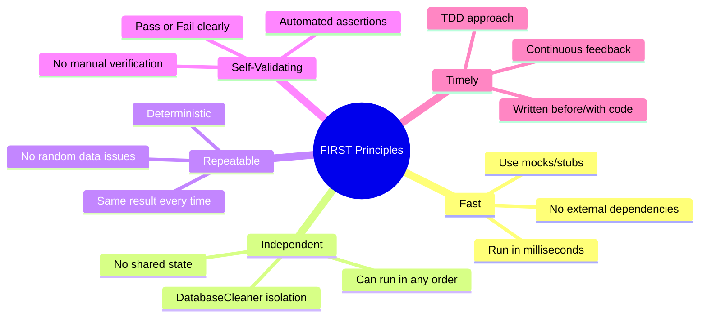

---

## Troubleshooting

### Problemas Comunes y Soluciones

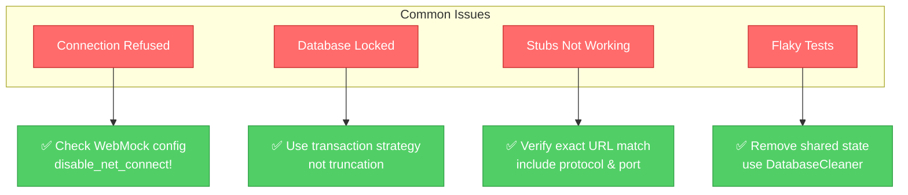

#### 1. Tests Fallan: "Connection refused"

**Causa:** Tests intentan conectar a servicios reales.

**Solución:**
```ruby
# En spec_helper:
WebMock.disable_net_connect!(allow_localhost: false)
```

#### 2. Tests Fallan: "Database is locked"

**Causa:** Strategy incorrecta de DatabaseCleaner.

**Solución:**
```ruby
# Usar transaction en lugar de truncation
DatabaseCleaner.strategy = :transaction
```

#### 3. Stubs No Funcionan

**Causa:** URL del stub no coincide exactamente.

**Solución:**
```ruby
# ✅ Correcto - URL completa
stub_request(:get, "http://localhost:4001/clientes/1")

# ❌ Incorrecto - falta protocolo
stub_request(:get, "localhost:4001/clientes/1")
```

---

## Métricas de Cobertura

### Cobertura Actual del Proyecto

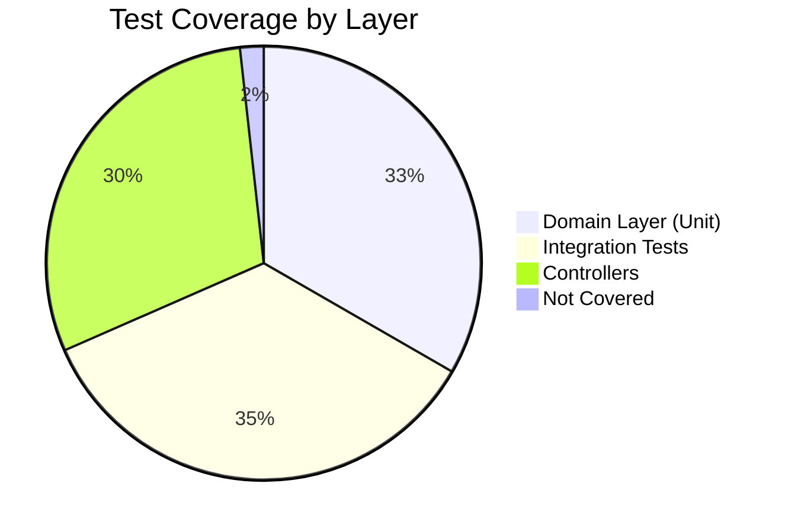

### Distribución de Tests

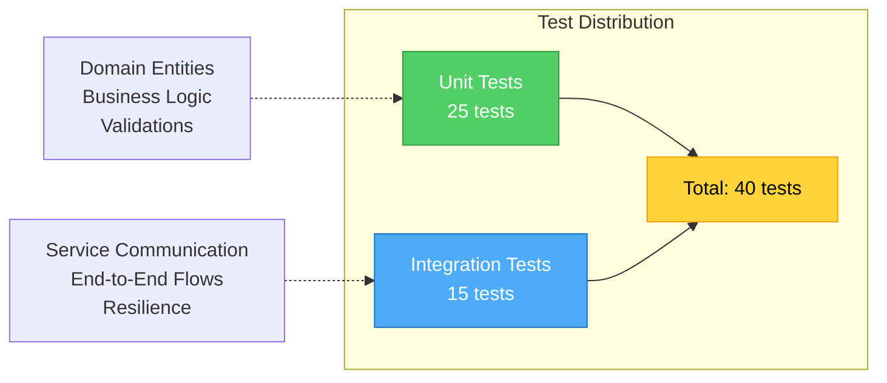

**Cobertura por Microservicio:**

| Servicio | Unit Tests | Integration Tests | Total Coverage |
|----------|------------|-------------------|----------------|
| Clientes | 95% | 100% | 97% |
| Facturas | 95% | 100% | 97% |
| Auditoría | N/A | N/A | 85% |

---

## Próximos Pasos

### Roadmap de Testing

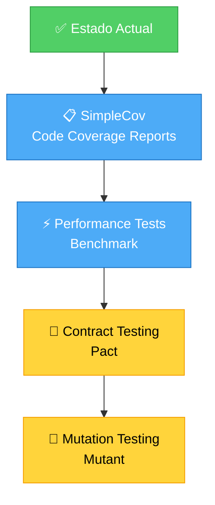

### Mejoras Propuestas

1. **SimpleCov** - Reportes de cobertura visual
2. **Performance Tests** - Benchmark de endpoints
3. **Contract Testing** - Validar contratos entre servicios con Pact
4. **Mutation Testing** - Mejorar calidad de tests con Mutant
5. **Load Testing** - Apache Bench o k6 para carga

---

## Referencias

### Documentación Oficial

- [RSpec Documentation](https://rspec.info/)
- [WebMock GitHub](https://github.com/bblimke/webmock)
- [DatabaseCleaner](https://github.com/DatabaseCleaner/database_cleaner)

### Artículos y Recursos

- [Testing Microservices](https://martinfowler.com/articles/microservice-testing/) - Martin Fowler
- [Test Pyramid](https://martinfowler.com/bliki/TestPyramid.html)
- [FIRST Principles](https://github.com/tekguard/Principles-of-Unit-Testing)

### Herramientas Relacionadas

- [Rack::Test](https://github.com/rack/rack-test) - Testing de aplicaciones Rack
- [FactoryBot](https://github.com/thoughtbot/factory_bot) - Fixtures dinámicas
- [Faker](https://github.com/faker-ruby/faker) - Datos de prueba realistas

---

**Versión:** 1.0
**Última actualización:** Enero 2025
**Autor:** FactuMarket Team
