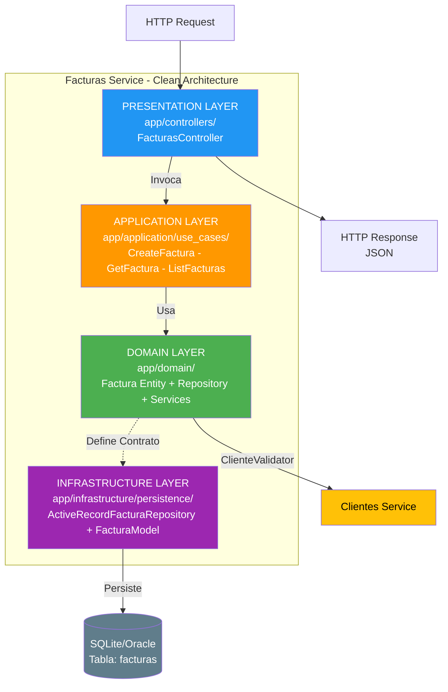
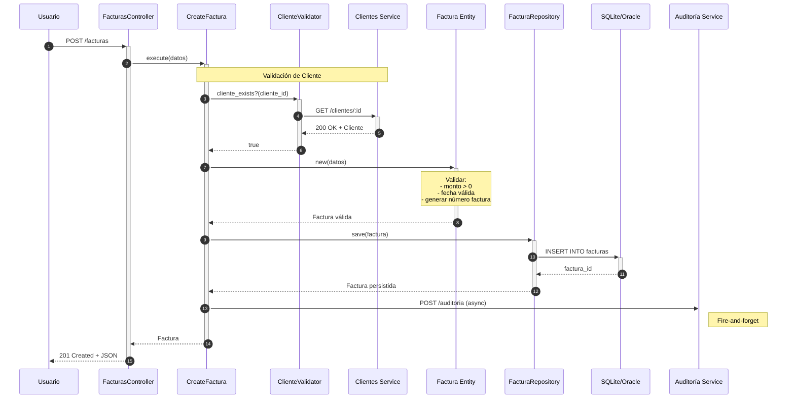
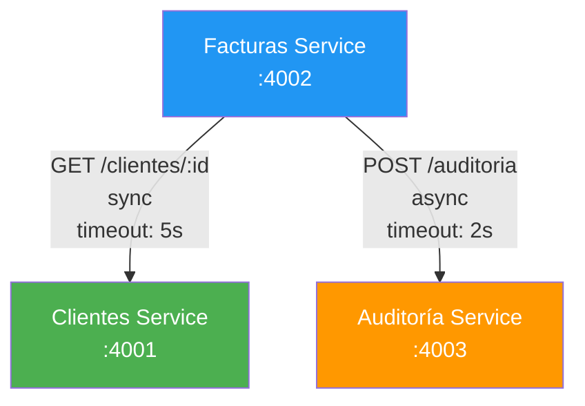

# Servicio de Facturas - FactuMarket

Microservicio responsable de la creación y gestión de facturas electrónicas del sistema FactuMarket.

## Propósito

Este servicio gestiona el ciclo de vida completo de las facturas electrónicas, permitiendo:
- Crear facturas con validación de cliente existente
- Generar números de factura únicos automáticamente
- Consultar facturas individuales
- Listar facturas con filtrado por rango de fechas
- Aplicar validaciones de negocio (monto, fecha, cliente)
- Registrar automáticamente eventos de auditoría

## Arquitectura

Implementa **Clean Architecture** combinado con **MVC**, con validación de cliente mediante comunicación con el servicio de Clientes.

### Capas de Clean Architecture



### Flujo de Creación de Factura



## Componentes Principales

### 1. Domain Layer

**`app/domain/entities/factura.rb`**
- Entidad de dominio que representa una Factura
- Reglas de negocio:
  - Cliente ID requerido
  - Monto debe ser mayor a 0
  - Fecha de emisión no puede ser futura
  - Generación automática de número de factura
  - Estado por defecto: "EMITIDA"
- Formato de número de factura: `F-YYYYMMDD-XXXXXXXX`

**`app/domain/repositories/factura_repository.rb`**
- Interface para operaciones de persistencia
- Operaciones: save, find_by_id, find_all, find_by_date_range

**`app/domain/services/cliente_validator.rb`**
- Servicio de dominio que valida existencia de cliente
- Comunica con servicio de Clientes vía HTTP
- Maneja errores de conectividad

### 2. Application Layer

**`app/application/use_cases/create_factura.rb`**
- Orquesta la creación de factura
- Valida cliente existe (comunicación con servicio externo)
- Crea entidad de dominio
- Persiste usando repositorio
- Registra evento en auditoría

**`app/application/use_cases/get_factura.rb`**
- Recupera factura por ID
- Registra evento de consulta

**`app/application/use_cases/list_facturas.rb`**
- Lista facturas con filtro opcional por fechas
- Soporta consultas como: todas las facturas del mes

### 3. Infrastructure Layer

**`app/infrastructure/persistence/active_record_factura_repository.rb`**
- Implementación con ActiveRecord
- Convierte entre modelos y entidades
- Query por rango de fechas

**`app/models/factura_model.rb`**
- Modelo ActiveRecord
- Serialización de items (JSON)
- Validaciones de base de datos

### 4. Presentation Layer

**`app/controllers/facturas_controller.rb`**
- API REST con Sinatra
- Maneja requests HTTP
- Validaciones de entrada
- Respuestas JSON

## API REST Endpoints

### POST /facturas
Crea una nueva factura electrónica.

**Request:**
```json
{
  "cliente_id": 1,
  "fecha_emision": "2025-01-13",
  "monto": 1500000,
  "items": [
    {
      "descripcion": "Laptop Dell",
      "cantidad": 1,
      "precio_unitario": 1500000,
      "subtotal": 1500000
    }
  ]
}
```

**Response (201 Created):**
```json
{
  "success": true,
  "message": "Factura creada exitosamente",
  "data": {
    "id": 1,
    "cliente_id": 1,
    "numero_factura": "F-20250113-A1B2C3D4",
    "fecha_emision": "2025-01-13",
    "monto": 1500000.0,
    "estado": "EMITIDA",
    "items": [...],
    "created_at": "2025-01-13T10:35:00Z",
    "updated_at": "2025-01-13T10:35:00Z"
  }
}
```

**Validaciones:**
- Cliente debe existir (validación con servicio de Clientes)
- Monto debe ser mayor a 0
- Fecha de emisión no puede ser futura
- Items es opcional pero debe ser un array

**Errores:**
- `400 Bad Request`: Datos inválidos (monto negativo, fecha futura)
- `500 Internal Server Error`: Cliente no existe, error de BD

### GET /facturas/:id
Consulta una factura específica.

**Request:**
```bash
GET /facturas/1
```

**Response (200 OK):**
```json
{
  "success": true,
  "data": {
    "id": 1,
    "cliente_id": 1,
    "numero_factura": "F-20250113-A1B2C3D4",
    "fecha_emision": "2025-01-13",
    "monto": 1500000.0,
    "estado": "EMITIDA",
    "items": [...],
    "created_at": "2025-01-13T10:35:00Z",
    "updated_at": "2025-01-13T10:35:00Z"
  }
}
```

**Errores:**
- `404 Not Found`: Factura no existe

### GET /facturas
Lista facturas con filtro opcional por rango de fechas.

**Sin filtros:**
```bash
GET /facturas
```

**Con rango de fechas:**
```bash
GET /facturas?fechaInicio=2025-01-01&fechaFin=2025-01-31
```

**Response (200 OK):**
```json
{
  "success": true,
  "data": [
    {
      "id": 1,
      "cliente_id": 1,
      "numero_factura": "F-20250113-A1B2C3D4",
      "fecha_emision": "2025-01-13",
      "monto": 1500000.0,
      "estado": "EMITIDA",
      "items": [...],
      "created_at": "2025-01-13T10:35:00Z",
      "updated_at": "2025-01-13T10:35:00Z"
    }
  ],
  "count": 1
}
```

### GET /health
Health check del servicio.

## Base de Datos

### Tabla: facturas

| Campo          | Tipo              | Descripción                          |
|----------------|-------------------|--------------------------------------|
| id             | INTEGER           | Primary Key (auto-increment)         |
| cliente_id     | INTEGER           | Foreign Key a clientes (índice)      |
| numero_factura | VARCHAR(50)       | Número único de factura (UNIQUE)     |
| fecha_emision  | DATE              | Fecha de emisión (índice)            |
| monto          | DECIMAL(10,2)     | Monto total de la factura            |
| estado         | VARCHAR(20)       | Estado (EMITIDA, ANULADA, etc.)      |
| items          | TEXT/JSON         | Detalles de items serializado        |
| created_at     | TIMESTAMP         | Fecha de creación                    |
| updated_at     | TIMESTAMP         | Fecha de última actualización        |

### Índices

- `cliente_id`: Para consultas rápidas por cliente
- `fecha_emision`: Para consultas por rango de fechas
- `numero_factura`: UNIQUE para garantizar unicidad

### Constraints

- `monto > 0`: Validación a nivel de BD

## Validaciones de Negocio

### Cliente Válido
```ruby
# Se valida antes de crear la factura
unless cliente_exists?(cliente_id)
  raise "Cliente con ID #{cliente_id} no existe"
end
```

### Monto Positivo
```ruby
raise ArgumentError, 'Monto debe ser mayor a 0' unless monto > 0
```

### Fecha de Emisión
```ruby
# No puede ser futura
fecha_emision <= Date.today
```

### Número de Factura Único
- Generado automáticamente
- Formato: `F-YYYYMMDD-HEXCODE`
- Ejemplo: `F-20250113-A1B2C3D4`

## Integración con Otros Servicios



### Servicio de Clientes
Comunicación **síncrona** para validar cliente:

```ruby
# app/domain/services/cliente_validator.rb
def cliente_exists?(cliente_id)
  response = HTTParty.get(
    "#{@clientes_service_url}/clientes/#{cliente_id}",
    timeout: 5
  )
  response.success?
end
```

**Manejo de errores:**
- Timeout: 5 segundos
- Si falla: La factura no se crea
- Garantiza integridad referencial

### Servicio de Auditoría
Comunicación **asíncrona** para registrar eventos:

```ruby
# Eventos registrados:
- CREATE: Factura creada exitosamente
- READ: Factura consultada
- LIST: Listado de facturas
- ERROR: Error en operación
```

## Instalación y Ejecución

### Setup

```bash
# Instalar dependencias
bundle install

# Configurar variables de entorno
cp .env.example .env

# Editar .env con URLs de otros servicios
# CLIENTES_SERVICE_URL=http://localhost:4001
# AUDITORIA_SERVICE_URL=http://localhost:4003

# Ejecutar migraciones
bundle exec rake db:migrate

# Iniciar servidor
bundle exec puma config.ru -p 4002
```

### Dependencias
Este servicio requiere que estén corriendo:
1. **Servicio de Auditoría** (Puerto 4003) - opcional
2. **Servicio de Clientes** (Puerto 4001) - **requerido**

### Con Docker

```bash
# Desde la raíz del proyecto
docker-compose up facturas-service
```

## Testing

### Ejecutar pruebas unitarias

```bash
bundle exec rspec
```

### Pruebas de dominio

**`spec/domain/entities/factura_spec.rb`**
- Valida creación correcta de factura
- Valida generación automática de número de factura
- Valida que cliente_id es requerido
- Valida que monto debe ser > 0
- Valida que fecha no puede ser futura
- Valida conversión a hash

```bash
bundle exec rspec spec/domain/entities/factura_spec.rb
```

### Pruebas de integración

```bash
# 1. Asegurar que servicio de Clientes esté corriendo
curl http://localhost:4001/health

# 2. Crear un cliente primero
curl -X POST http://localhost:4001/clientes \
  -H "Content-Type: application/json" \
  -d '{
    "nombre": "Test Cliente",
    "identificacion": "900999888",
    "correo": "test@test.com",
    "direccion": "Test 123"
  }'

# 3. Crear factura para ese cliente
curl -X POST http://localhost:4002/facturas \
  -H "Content-Type: application/json" \
  -d '{
    "cliente_id": 1,
    "fecha_emision": "2025-01-13",
    "monto": 1000000,
    "items": []
  }'

# 4. Consultar factura
curl http://localhost:4002/facturas/1

# 5. Listar facturas por fecha
curl "http://localhost:4002/facturas?fechaInicio=2025-01-01&fechaFin=2025-12-31"
```

## Estructura de Archivos

```
facturas-service/
├── app/
│   ├── controllers/
│   │   └── facturas_controller.rb          # API REST
│   ├── models/
│   │   └── factura_model.rb                # ActiveRecord
│   ├── domain/
│   │   ├── entities/
│   │   │   └── factura.rb                  # Entidad de dominio
│   │   ├── repositories/
│   │   │   └── factura_repository.rb       # Interface
│   │   └── services/
│   │       └── cliente_validator.rb        # Servicio de dominio
│   ├── application/
│   │   └── use_cases/
│   │       ├── create_factura.rb           # Caso de uso
│   │       ├── get_factura.rb
│   │       └── list_facturas.rb
│   └── infrastructure/
│       └── persistence/
│           └── active_record_factura_repository.rb
├── config/
│   ├── database.yml
│   └── environment.rb
├── db/
│   └── migrate/
│       └── 001_create_facturas.rb
├── spec/
│   └── domain/
│       └── entities/
│           └── factura_spec.rb
├── .env.example
├── config.ru
├── Dockerfile
├── Gemfile
└── README.md
```

## Variables de Entorno

```bash
PORT=4002
DATABASE_URL=sqlite3:db/facturas.sqlite3
CLIENTES_SERVICE_URL=http://localhost:4001       # REQUERIDO
AUDITORIA_SERVICE_URL=http://localhost:4003
RACK_ENV=development
```

## Manejo de Errores

### Cliente No Existe
```json
{
  "success": false,
  "error": "Cliente con ID 999 no existe o no está disponible"
}
```

### Servicio de Clientes No Disponible
Si el servicio de Clientes no responde:
- Timeout de 5 segundos
- Se retorna error al usuario
- No se crea la factura
- Se registra evento de error en auditoría

### Monto Inválido
```json
{
  "success": false,
  "error": "Monto debe ser mayor a 0"
}
```

### Fecha Futura
```json
{
  "success": false,
  "error": "Fecha de emisión inválida"
}
```

## Ejemplo de Flujo Completo

```bash
# 1. Verificar salud de servicios
curl http://localhost:4001/health  # Clientes
curl http://localhost:4002/health  # Facturas

# 2. Crear cliente
CLIENTE=$(curl -s -X POST http://localhost:4001/clientes \
  -H "Content-Type: application/json" \
  -d '{
    "nombre": "Almacenes La 14",
    "identificacion": "900555123",
    "correo": "info@la14.com",
    "direccion": "Calle 14 #5-20"
  }')

CLIENTE_ID=$(echo $CLIENTE | jq -r '.data.id')
echo "Cliente creado: $CLIENTE_ID"

# 3. Crear factura
FACTURA=$(curl -s -X POST http://localhost:4002/facturas \
  -H "Content-Type: application/json" \
  -d "{
    \"cliente_id\": $CLIENTE_ID,
    \"fecha_emision\": \"2025-01-13\",
    \"monto\": 2500000,
    \"items\": [
      {
        \"descripcion\": \"Televisor Samsung 55\",
        \"cantidad\": 1,
        \"precio_unitario\": 2500000
      }
    ]
  }")

echo $FACTURA | jq .

# 4. Verificar eventos de auditoría
FACTURA_ID=$(echo $FACTURA | jq -r '.data.id')
curl http://localhost:4003/auditoria/$FACTURA_ID | jq .
```

## Mejoras Futuras

- [ ] Implementar anulación de facturas
- [ ] Agregar soporte para descuentos e impuestos
- [ ] Implementar generación de PDF de factura
- [ ] Agregar firma electrónica
- [ ] Integración con DIAN (autoridad tributaria)
- [ ] Implementar Circuit Breaker para llamadas a servicio de Clientes
- [ ] Caché de validación de clientes con Redis
- [ ] Versionado de facturas
- [ ] Soporte para facturas recurrentes

## Integración Futura con DIAN

El servicio está preparado para integración con la DIAN:

```
Facturas Service → DIAN Adapter → DIAN API
                ↓
           Auditoría
```

Se puede agregar:
- Validación de formato de factura electrónica
- Generación de XML según estándar DIAN
- Firma digital con certificado
- Envío a plataforma DIAN
- Consulta de estado de factura

## Contacto

Desarrollado para FactuMarket S.A.

Ver [README principal](../README.md) para documentación completa del sistema.
